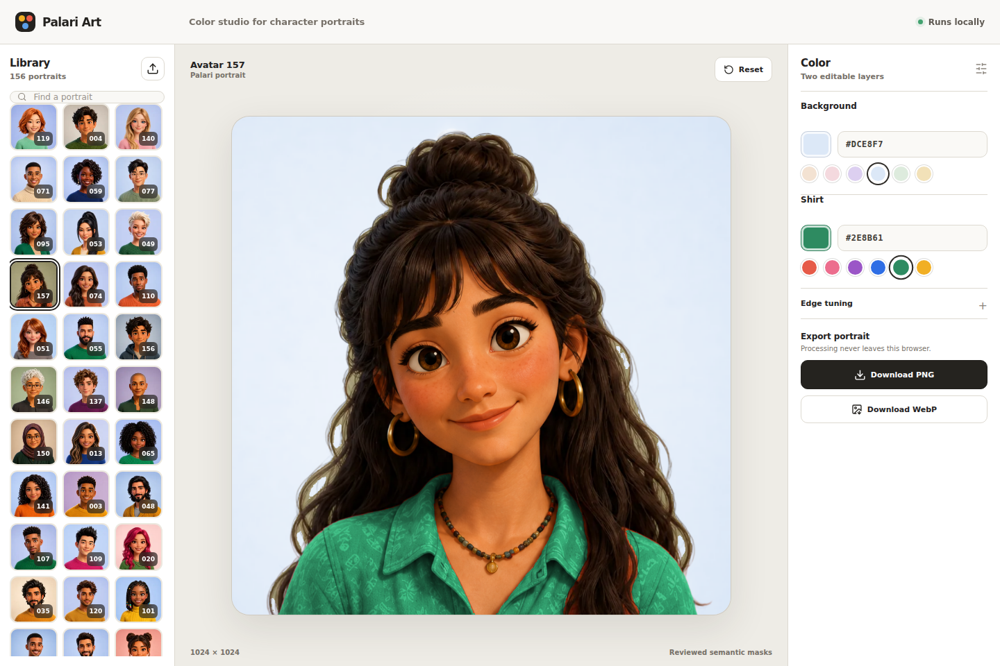
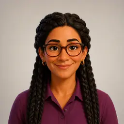
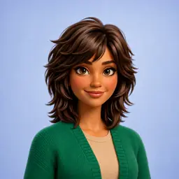
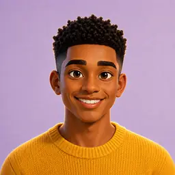
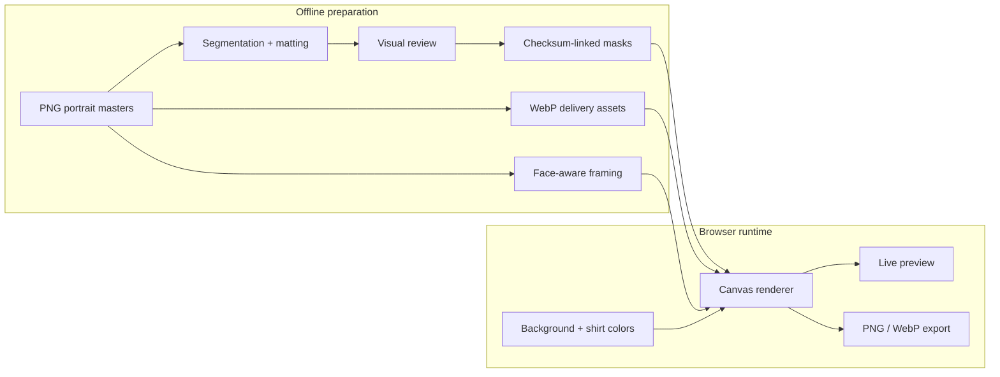

<div align="center">

# Palari Art

### A reviewed portrait library and local-first color studio

Change a character's background and shirt while preserving the face, hair, accessories, texture, lighting, and identity.

`157 source portraits` · `156 active characters` · `1024 × 1024 export` · `browser-only runtime`

[Choose a Palari V3](https://coystan.github.io/palari-art/v3/) · [Open the portrait editor](https://coystan.github.io/palari-art/) · [Create a ceramic Palari](https://coystan.github.io/palari-art/v2/) · [View the art gallery](https://coystan.github.io/palari-art/handbook/)

</div>

<picture>
  <source media="(max-width: 600px)" srcset="docs/readme/editor-mobile.webp">
  
</picture>

Palari Art is the source of truth for Palari's standardized character portraits, their reviewed semantic layers, and the browser tools used to recolor them safely. The editor presents one stable mixed library, previews changes instantly, and exports PNG or WebP without sending portrait data to a backend.

The repository also publishes a text-free responsive gallery of 20 reviewed Palari teaching plates. The source art and its provenance remain in the repository; only optimized WebPs are deployed.

Palari V2 is a separate ceramic-character system: 41 reviewed figures with selectable ceramic material, one characteristic inner-intelligence color, background, and local 1024px PNG export. It is available at `/v2/` and does not alter the portrait editor.

Palari V3 is the icon-first direction at `/v3/`: an expanded family of 24 friendly avatars, including six retained V2 silhouettes and 18 native characters. Moss, Poppy, and Sunny anchor the mouthless, emblem-free direction. The newest six use deterministic flat-first geometry, a solid navy field, measured micro-gradients, and one small ivory catchlight per pupil. Their live versions are built skeleton-first from an explicit 11-joint graph; the soft shelter, face, arms, and eyes are derived afterward. A Cover/Bones switch exposes both stages. Body bounce, head lag, arm follow-through, blinking eyes, moving pupils, and tap-to-hop share the skeleton pivots. **Make one** creates a new skeleton and cover from a shareable numeric seed without an image-generation request. Visitors can pause motion, switch among soft, circle, and square frames, and download a local 1024px PNG. The ceramic and 3D work remains separate.

Development builds also expose a local-only `/3d/` review page for the experimental Palari 005 3D work. A shared Three.js camera switches between the original Meshy reconstruction, a reproducible Blender repair, and a translucent alignment overlay. The Blender v1 keeps Meshy's front and replaces the fused rear-arm bridge with a fitted ceramic rear shell. Its GLB and four-angle Blender renders remain review artifacts; side arm caps and the rear material seam still need a manual sculpt/texture pass. Both models and the reviewer remain excluded from GitHub Pages until the geometry is approved.

## At a glance

| Library | Editing | Delivery | Safety |
| --- | --- | --- | --- |
| 157 checksum-locked PNG masters | Background and shirt only | 1024px editor WebPs | Reviewed garment masks |
| 156 active portraits | Nondestructive face-aware framing | 256px gallery thumbnails | Protected hair and neck |
| Stable IDs; Avatar 024 archived | Local Canvas rendering | 1024 × 1024 PNG/WebP export | No runtime ML or API key |

<p align="center">
  
  
  
  
  
  
</p>

On classic phone widths, the interface becomes a single-screen composition: the preview uses roughly 60% of the width, a two-column portrait rail fills the right side, and compact background and shirt swatches sit below. Wider layouts expose search, precise color input, edge tuning, uploads, and export controls.

## How it works



The expensive image understanding happens once during controlled asset preparation. The shipped application performs deterministic pixel compositing in the browser, so moving a color control never triggers an AI request.

## Repository status

The interface and export flow work. All 157 bundled portraits use reviewed fal.ai SAM 3 garment masks plus BiRefNet v2 foreground mattes and source-linked face-aware framing metadata. Reproducible FFmpeg/libwebp pipelines reduce the portrait delivery tier from 308.4 MiB to 11.0 MiB and the runtime mask tier from 322.8 MiB to 204.4 MiB with zero decoded pixel differences. Every PNG master remains unchanged. The 105 Los 5 fantásticos portraits use the clean-render v3 artwork revision, 12 purpose-generated portraits fill documented variation gaps, and two user-selected art-guide characters have high-resolution production remakes. Background and shirt recoloring remains local and deterministic in the browser; APIs are used only by offline asset-preparation scripts.

Temporary user uploads still use the prototype color detector because there is no upload-segmentation service. That fallback estimates the background from the image corners and the shirt from colors near the bottom of the portrait, so results can vary. See [Masking strategy](docs/MASKING.md) and [full-library results](docs/FULL-LIBRARY-RESULTS.md).

## What is included

| Area | Current state |
| --- | --- |
| Bundled portraits | 157 standardized square PNGs |
| Web delivery | 157 full 1024px WebP files plus 157 256px WebP thumbnails; 96.4% fewer bytes than the PNG masters |
| Pages artifact | 231.6 MiB, 2,195 WebPs, no PNG masters, PDF, or audit layers |
| Library | One mixed grid containing 156 active portraits; Avatar 024 (`expanded-14`) is retired without renumbering later portraits |
| Editable layers | Background and shirt |
| Protected details | Face, hair, accessories, texture, lighting, and identity |
| Exports | 1024 × 1024 PNG and WebP |
| Uploaded images | PNG, JPEG, or WebP for the current browser session |
| Processing | Browser Canvas at runtime; fal.ai is used only by the preparation script |
| Semantic layers | 1,395 lossless runtime-mask WebPs derived from reviewed PNG authorities; 154 portraits have visible-hair layers and 3 are explicitly exempt |
| Framing | All 157 portraits use source-linked face-aware scale/center metadata; originals and masks remain unchanged |
| Variation planning | 157 visual-attribute records plus a documented coverage report |
| Known limitation | Temporary uploads still use color-estimated masks |
| Art gallery | 20 reviewed teaching plates in a text-free responsive gallery; no PDF |
| Ceramic V2 | 41 reviewed figures, 123 WebP delivery assets, material/characteristic/background controls, PNG export |
| Avatar V3 | 24 icon-first companions, skeleton-first generation, Cover/Bones inspection, motion, and local 1024px PNG download |

## Start the application

Requirements:

- Node.js 22.12 or newer
- npm 10 or newer
- FFmpeg with the `libwebp` encoder when regenerating web delivery assets (not required just to run the app)
- ImageMagick `compare` when regenerating lossless runtime-mask WebPs

Install the locked dependencies and start Vite:

```bash
npm ci
npm run dev
```

The development server binds to all interfaces on port `4173`.

- On the server: `http://localhost:4173`
- Over the current Tailnet: `http://100.113.33.46:4173`
- Experimental 3D review: `http://100.113.33.46:4173/3d/`

The Tailnet address is an environment detail, not an application configuration. Confirm it with `tailscale ip -4` if the link stops working.

## Validate a change

```bash
npm run check
```

This verifies the avatar inventory, masks, face-aware framing metadata, attributes, TypeScript, and production build. For image-processing changes, also inspect several portraits visually; compilation cannot detect a bad mask or crop.

Regenerate and verify the gallery after changing its teaching art:

```bash
npm run handbook:assets:generate
npm run verify:handbook
```

Regenerate the derived WebP delivery files after changing any source portrait:

```bash
npm run avatars:web:generate
npm run verify:web-assets
```

Regenerate the pixel-identical runtime-mask WebPs after changing any reviewed runtime mask:

```bash
npm run masks:web:generate
npm run verify:web-masks
```

Regenerate and verify the ceramic V2 delivery tier after changing a V2 source or mask:

```bash
npm run palari-v2:web:generate
npm run verify:palari-v2
```

Regenerate and verify the V3 avatar delivery tier after changing a native V3 icon:

```bash
npm run palari-v3:web:generate
npm run verify:palari-v3
```

Build the PNG-free GitHub Pages artifact with:

```bash
npm run build:pages
```

To generate or resume masks for the bundled library, copy `.env.example` to `.env.local`, add `FAL_KEY`, and run:

```bash
npm run masks:generate
npm run mattes:generate
```

Existing outputs with the same model and source checksum are skipped unless `-- --force` is added. Limit either run with `-- --id=original-01`. Generated layers are not production-ready until they are visually reviewed and recorded with `npm run masks:review` or `npm run mattes:review`.

The Los 5 fantásticos collection has a provenance-checked importer for its 21 five-character Drive sources and a separate identity-guided redraw workflow for the production portraits. See [Los 5 fantásticos import](docs/FANTASTICOS-IMPORT.md) and [redraw system](docs/FANTASTICOS-REDRAW.md) before refreshing that collection.

## Repository map

```text
palari-art/
├── AGENTS.md                 Instructions and guardrails for coding agents
├── docs/
│   ├── ARCHITECTURE.md       Application structure and data flow
│   ├── ASSETS.md             Portrait collections and asset conventions
│   ├── AVATAR-COVERAGE.md    Visual-attribute distributions and generation gaps
│   ├── COVERAGE-EXPANSION.md Generation provenance for the 12 gap-filling portraits
│   ├── FANTASTICOS-IMPORT.md Reproducible group-image import workflow
│   ├── FANTASTICOS-REDRAW.md Identity-guided production redraw system
│   ├── FULL-LIBRARY-RESULTS.md Complete SAM 3 collection evaluation
│   ├── HANDBOOK.md            Handbook editorial, asset, print, and publication contract
│   ├── MASKING.md            Semantic mask workflow and upload fallback
│   ├── DEPLOYMENT.md         GitHub Pages artifact and release workflow
│   ├── PILOT-RESULTS.md       Five-avatar SAM 3 evaluation
│   └── STATUS.md             Concise handoff and next milestones
├── public/avatars/           Checksum-locked 1254px PNG portrait masters
├── public/avatars-web/       Generated 1024px WebP portraits and 256px thumbnails
├── public/masks/             Reviewed semantic layers and generation metadata
├── public/masks-web/         Pixel-identical lossless WebP runtime layers
├── public/handbook/          Gallery WebPs and checksum manifest
├── public/palari-v2/         Reviewed ceramic masters, masks, and metadata
├── public/palari-v2-web/     Checksum-linked V2 runtime WebPs
├── public/palari-v3-icons-web/ V3 avatar WebPs and checksum manifest
├── scripts/generate-avatar-masks.mjs  Resumable fal.ai preparation batch
├── scripts/clean-shirt-mask-components.mjs Remove tiny disconnected SAM garment islands
├── scripts/generate-foreground-mattes.mjs  Resumable BiRefNet matting batch
├── scripts/generate-avatar-framing.py Local face-aware framing metadata generator
├── scripts/generate-web-avatar-assets.mjs Reproducible FFmpeg/libwebp delivery pipeline
├── scripts/generate-web-mask-assets.mjs Lossless runtime-mask WebP pipeline
├── scripts/prepare-pages-artifact.mjs PNG-free GitHub Pages packager
├── scripts/import-fantasticos.mjs Split, matte, and standardize the 105 new portraits
├── scripts/apply-fantasticos-redraw.mjs Validate and apply 105 reviewed redraws
├── scripts/clean-fantasticos-foregrounds.mjs Remove verified neighboring-panel fragments
├── scripts/verify-assets.mjs Asset inventory and dimension validation
├── src/components/           React interface components
├── src/handbook/             Text-free responsive teaching-art gallery
├── src/v2/                   Separate ceramic character editor
├── src/v3/                   Icon-first V3 avatar picker and local export
├── src/data/avatar-masks.json Semantic mask registry
├── src/data/avatar-framing.json Source-linked scale and center metadata
├── src/data/avatar-attributes.json Visual variation planning metadata
├── src/data/avatars.ts       Portrait registry
├── src/lib/color.ts          Color conversion and blending helpers
├── src/lib/recolor.ts        Current mask estimation and Canvas renderer
└── src/App.tsx               Application state and screen composition
```

## Documentation

- Read [AGENTS.md](AGENTS.md) before making an automated change.
- Read [Architecture](docs/ARCHITECTURE.md) before changing the renderer or introducing a server.
- Read [Avatar assets](docs/ASSETS.md) before adding, renaming, replacing, or synchronizing portraits.
- Read [Los 5 fantásticos import](docs/FANTASTICOS-IMPORT.md) before regenerating that collection from Drive.
- Read [Los 5 fantásticos redraw system](docs/FANTASTICOS-REDRAW.md) before regenerating its production artwork.
- Read [Masking strategy](docs/MASKING.md) before working on segmentation or adding an API key.
- Read [Deployment](docs/DEPLOYMENT.md) before changing the Pages base path, workflow, or artifact contract.
- Read [Full-library results](docs/FULL-LIBRARY-RESULTS.md) before changing prompts or regenerating semantic masks.
- Read [Avatar variation coverage](docs/AVATAR-COVERAGE.md) before planning a new portrait generation batch.
- Read [Art gallery](docs/HANDBOOK.md) before changing gallery presentation, teaching plates, or inclusion rules.
- Update [Current status](docs/STATUS.md) whenever a milestone or technical boundary changes.

## Product boundaries

- Background and shirt color are the only user-editable properties currently in scope.
- Hair recoloring is intentionally out of scope.
- Recoloring should preserve the original character design; it must not regenerate facial features or clothing.
- Bundled production portraits are stable inputs to the recoloring runtime. Deliberate artwork revisions require explicit provenance plus regenerated and reviewed masks; ordinary color variants must never overwrite them.
- Google Drive is used for sharing and delivery, but this repository does not currently synchronize with Drive automatically.
- No public reuse license is declared. The gallery artwork is explicitly all-rights-reserved Palari material.
