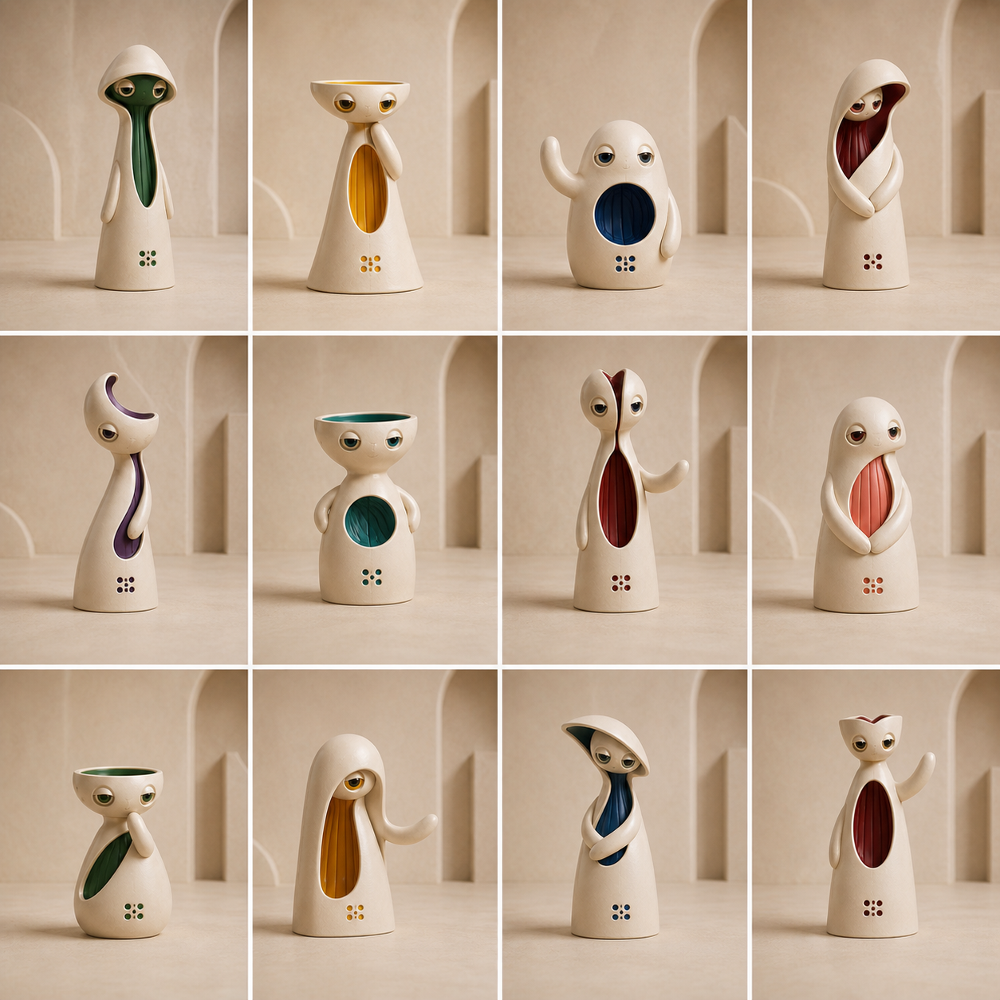
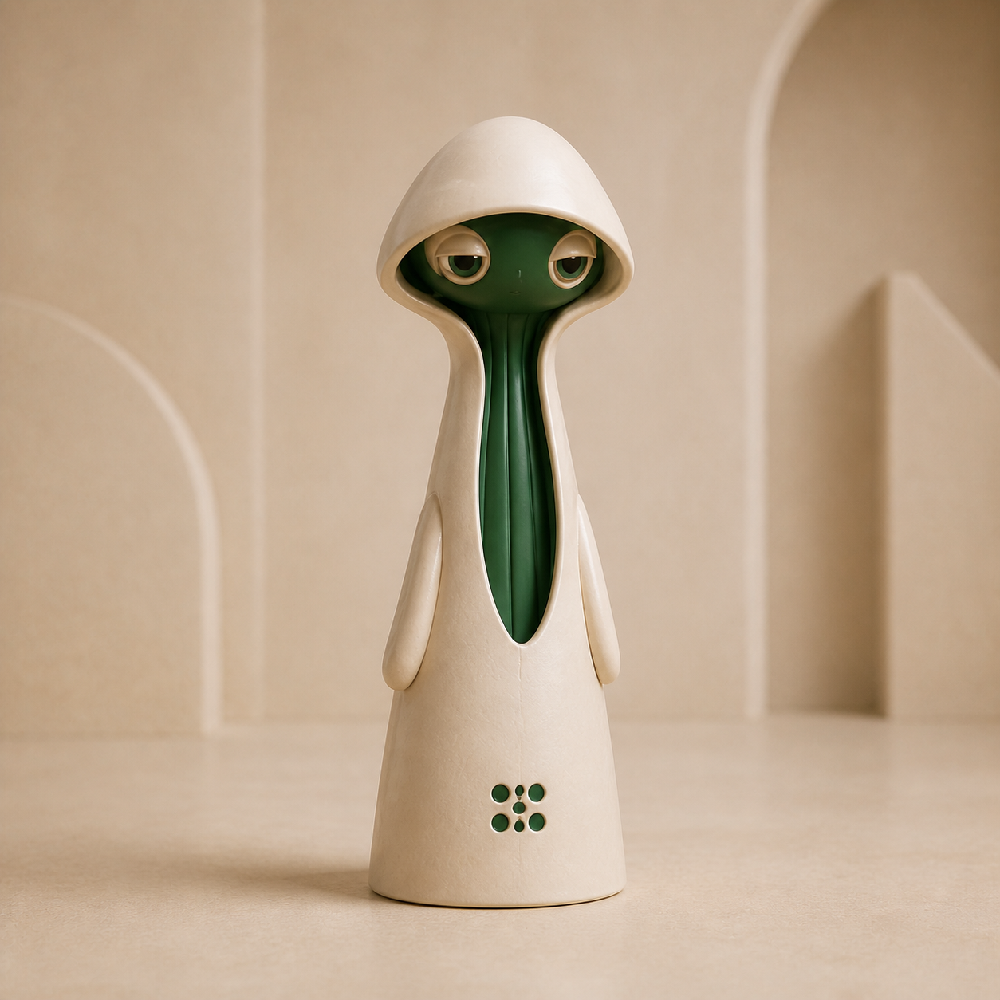
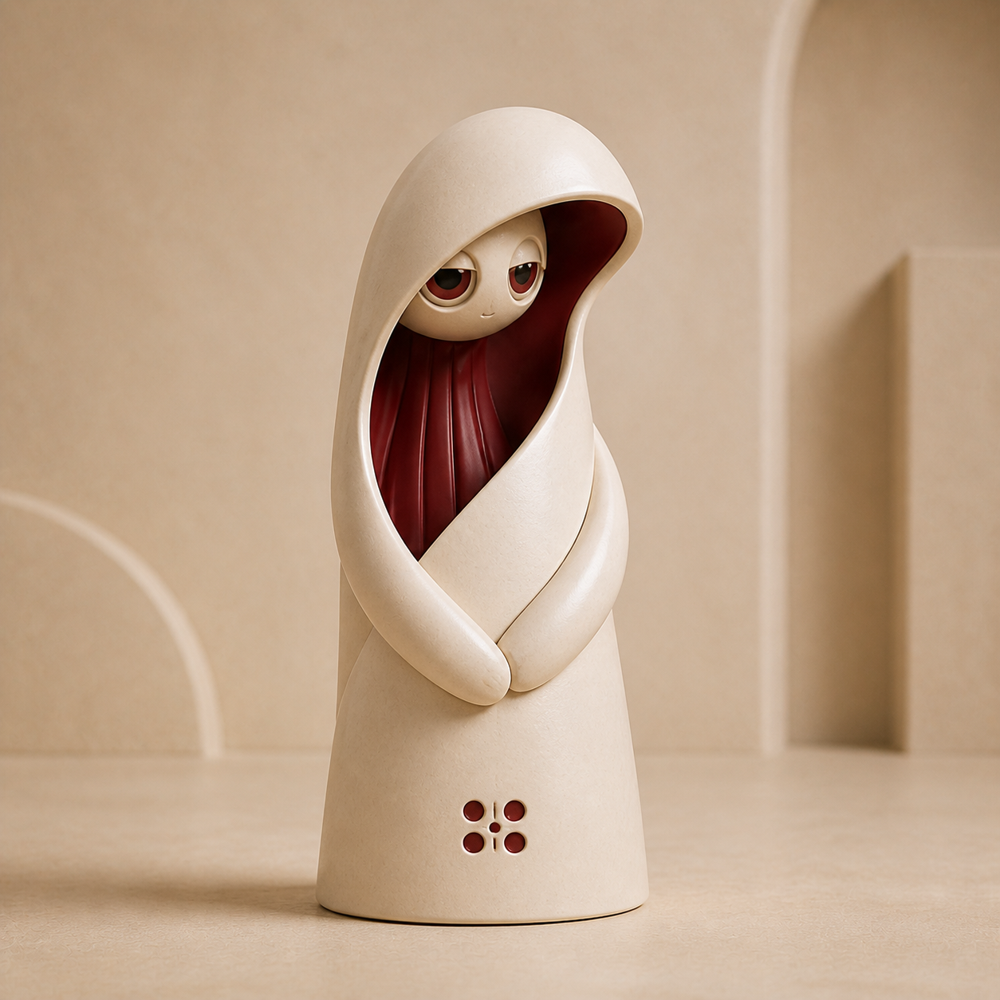
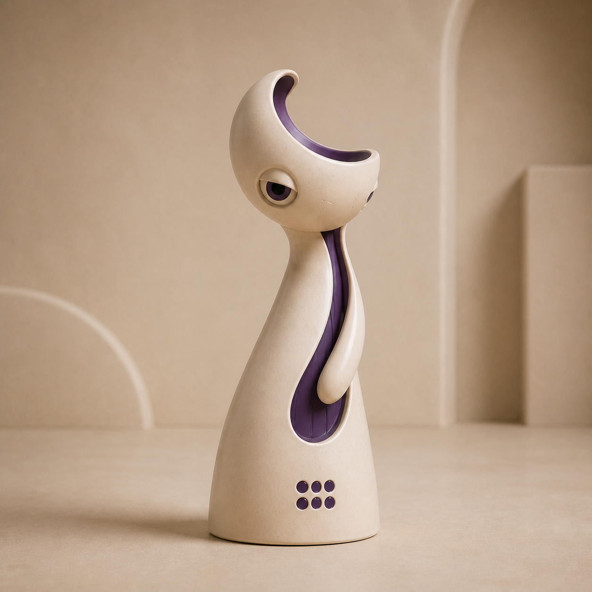
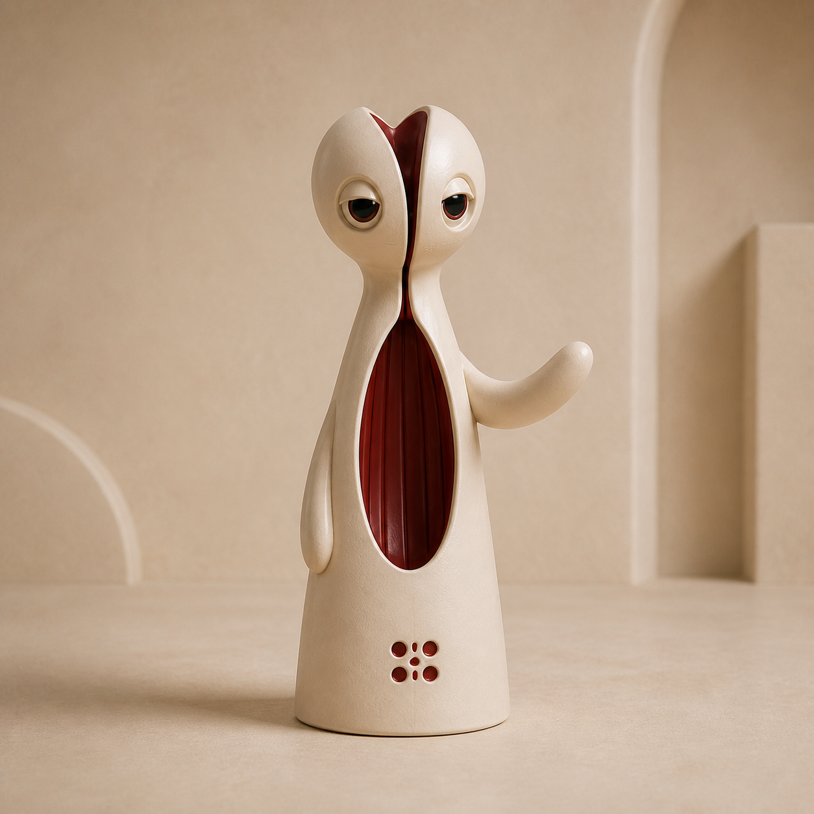
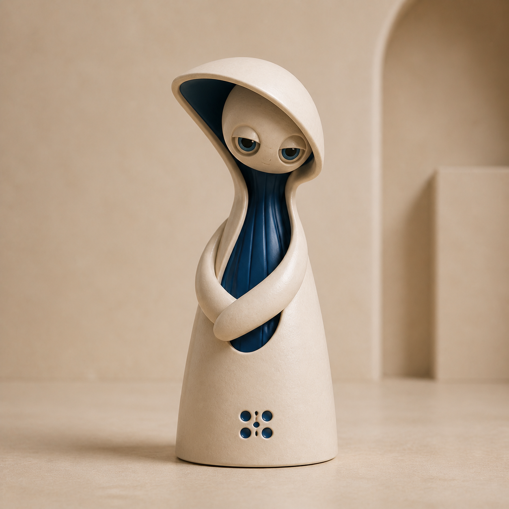
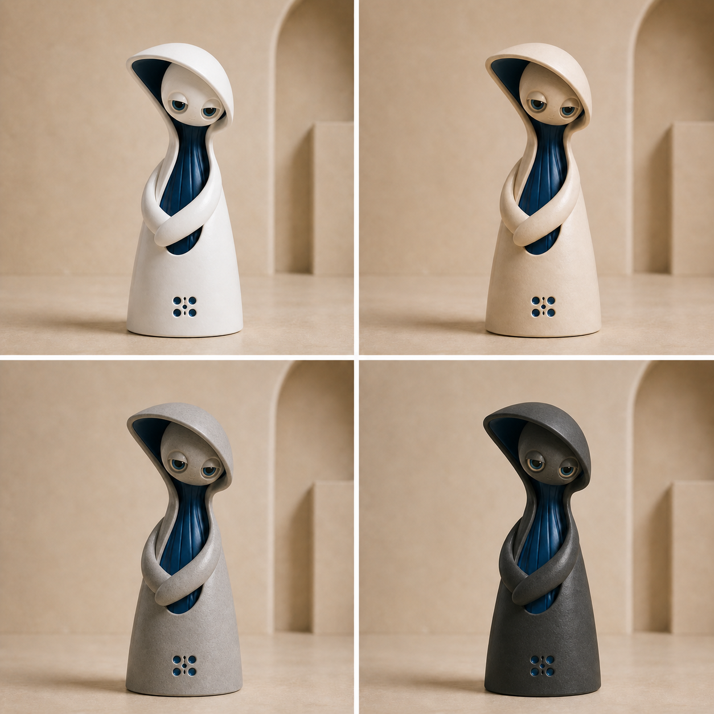

# Palari V2 ceramic character system

Status: exploratory design direction; not yet part of the production editor or portrait library.

## Meaning

**Palari** means **Personal Artificial Intelligence**.

A Palari is a small ceramic vessel whose colored interior reveals its unique intelligence. The outer body gives the family a shared physical language; the inner color gives each individual its characteristic identity.

Palari V2 moves away from portraits of people. It introduces a recognizable species of crafted artificial beings: calm, expressive, collectible, and personal without imitating human anatomy.

## Product idea

Every figure has two user-selected color systems:

1. **Material color** — the ceramic exterior: porcelain white, warm ivory, charcoal black, or stone grey.
2. **Characteristic color** — one accent color representing the Palari's inner intelligence.

The characteristic color may appear in recessed interior surfaces, eye details, and a small signature mark. It is not clothing and should not become a collection of unrelated decorative colors.

Background color is a presentation choice and is not part of the character's identity.

## Family invariants

These traits should make an unfamiliar silhouette immediately recognizable as a Palari:

- A tactile ceramic or fine-stoneware exterior with subtle handmade surface variation.
- A single smooth body mass with no conventional human torso-to-pelvis construction.
- Large, calm, emotionally legible eyes using one consistent construction language.
- Simple curved arms ending in rounded, fingerless forms.
- No conventional legs, feet, shoes, or visible human anatomy. A tiny base separation or shadow notch is acceptable.
- One or more deliberate openings that reveal the colored inner intelligence.
- Exactly one characteristic color per figure.
- A restrained face: eyes carry the expression; a tiny mouth is optional.
- A stable upright base so the figure reads as a physical ceramic object.
- A small six-dot Palari signature, if testing confirms that it reads as identity rather than a speaker grille.

## Controlled variation

Random generation should combine a small number of controlled decisions rather than inventing every feature independently.

### Silhouette families

- **Column** — tall, narrow, quiet, observant.
- **Bell** — gently flared base, balanced and welcoming.
- **Pod** — short, rounded, grounded and warm.
- **Arch** — protective shell or hood framing the inner form.
- **Crescent** — asymmetric sweep with a strong directional gesture.
- **Stack** — two or three interlocking ceramic masses, still read as one figure.

These names describe geometry and temperament, not gender, age, ethnicity, nationality, religion, or other human demographics.

### Head and crown treatments

- Continuous dome.
- Shallow bowl or elliptical rim.
- Soft hood or overhang.
- Split petal or restrained crown.
- Asymmetric crest.
- Head integrated into the body with no separate neck.

Open tops should feel intentional and finished. Avoid shapes that primarily read as broken pottery, kitchenware, or an empty plant pot.

### Inner openings

- Vertical oval.
- Narrow channel.
- Circular aperture.
- Asymmetric leaf opening.
- Side reveal.
- Layered overlap exposing the interior between shells.

Use one dominant opening and, at most, one supporting reveal. The opening should feel structurally designed, not cut out at random.

### Arm poses

- Resting together.
- One arm raised in greeting.
- One rounded arm tip near the face in thought.
- Arms folded softly around the body.
- One arm resting at the side.
- One curved arm extended in a welcoming gesture.

Arms remain tubular and fingerless in every pose. Gesture should communicate personality without human hand anatomy.

### Eye expression

- Attentive.
- Curious.
- Serene.
- Thoughtful.
- Gently amused.
- Quietly confident.

Avoid exaggerated cartoon emotion, vacant doll eyes, visible distress, or a threatening mechanical stare.

## Color contract

### Material palette

The initial material set should be deliberately small:

| Name | Direction |
| --- | --- |
| Porcelain | Soft neutral white; never pure digital white |
| Ivory | Warm creamy ceramic |
| Stone | Balanced warm grey |
| Charcoal | Near-black ceramic with readable highlights |

All material colors must retain ceramic texture, edge highlights, shadows, and form. A dark body must not become a flat silhouette.

### Characteristic color

The characteristic color is continuous across all inner surfaces and small identity details. It may vary in lightness with illumination and depth, but it must remain one perceived hue.

Good initial families include forest green, deep blue, burgundy, amber, violet, teal, coral, and mineral red. Extremely neon, rainbow, metallic, or multicolor interiors are outside the initial system.

The eyes may borrow the characteristic color in the iris or recessed surround. The sclera, pupil, reflections, and ceramic eyelids may remain neutral where needed for legibility.

## Things that are not Palari V2

- Human portraits wearing ceramic clothing.
- Conventional humanoid robots, android joints, screens, wires, or exposed machinery.
- Fingers, realistic hands, toes, shoes, or clearly separated legs.
- Hair, fabric garments, jewelry, or demographic costume shorthand.
- Multiple competing accent colors.
- Photoreal human skin or anatomy.
- Cute toy styling with oversized smiles and generic mascot proportions.
- Cracked, chipped, dirty, distressed, or antique pottery unless a later story explicitly requires it.
- A cup, vase, lamp, speaker, or appliance with eyes added to it.
- Random holes without a clear relationship to the inner intelligence.

## First exploration batch

The first batch should test the system, not maximize quantity. Generate 12 figures as isolated full-body studies with the same camera, lighting, scale, and environment.

| Study | Silhouette | Head treatment | Opening | Pose | Characteristic color |
| ---: | --- | --- | --- | --- | --- |
| 01 | Column | Soft hood | Narrow channel | Arms resting | Forest |
| 02 | Bell | Shallow bowl | Vertical oval | Thoughtful | Amber |
| 03 | Pod | Continuous dome | Circular aperture | Greeting | Deep blue |
| 04 | Arch | Integrated hood | Leaf opening | Embracing | Burgundy |
| 05 | Crescent | Asymmetric crest | Side reveal | One arm at side | Violet |
| 06 | Stack | Elliptical rim | Circular aperture | Confident | Teal |
| 07 | Column | Split petal | Vertical oval | Greeting | Mineral red |
| 08 | Bell | Integrated head | Layered reveal | Arms resting | Coral |
| 09 | Pod | Shallow bowl | Asymmetric oval | Thoughtful | Forest |
| 10 | Arch | Continuous dome | Narrow channel | Open gesture | Amber |
| 11 | Crescent | Soft overhang | Side reveal | Arms folded | Deep blue |
| 12 | Stack | Restrained crown | Vertical oval | One arm raised | Burgundy |

Use primarily porcelain or ivory bodies in this batch so silhouette and family resemblance can be judged without material color becoming a confounding variable. After selecting the strongest forms, rerender the finalists in porcelain, ivory, stone, and charcoal.

### Exploration sheet 01

The first controlled contact sheet was generated on 2026-08-08 using the user-provided ceramic studies as visual references. It follows the 12-study matrix above in row-major order and keeps the camera, warm architectural environment, ivory material, eye language, fingerless arms, absent legs, and six-dot signature consistent.

- Source: `docs/palari-v2/exploration-sheet-01.png`
- Dimensions: 1254 × 1254 RGB PNG
- SHA-256: `e3afe99817d029feb2bbc45b269c475ae44b00daec6ca3fac8300caef8ecd06f`
- Review state: exploratory; not approved as production character art

The initial visual review favors studies 01, 04, 05, 07, and 11. Studies 02, 06, and 09 demonstrate a useful failure mode: a simple horizontal open rim can make a Palari read as a bowl or cup. Finalists should prefer protective overhangs, shaped crowns, or integrated architectural openings.

## Individual finalist studies

Five 1254 × 1254 RGB PNG studies were generated on 2026-08-08 from exploration-sheet cells 01, 04, 05, 07, and 11. Each uses the contact sheet as an identity and style reference while resolving the selected figure as a standalone square render.

| Study | File | SHA-256 |
| ---: | --- | --- |
| 01 | `docs/palari-v2/finalist-01-column-forest.png` | `dc1e897732593b132d91c588ebfa0f62b8ec6334e2f131af4ad2743839100e1c` |
| 04 | `docs/palari-v2/finalist-04-arch-burgundy.png` | `85d633a95d5998aa8844c4b9f64b8a0ed9ab8dfc0ac025eb0ab71d68e3d2256c` |
| 05 | `docs/palari-v2/finalist-05-crescent-violet.png` | `553ad7fc490ed662c359ed5994ba6191b12d062706cb64b22d65ab51927cff83` |
| 07 | `docs/palari-v2/finalist-07-column-mineral-red.png` | `a6932ada5d2bc65f9034d5b2b7cb03011a3cca23fd015fb69dfe02078de27dc6` |
| 11 | `docs/palari-v2/finalist-11-arch-ultramarine.png` | `b2586668372d925c52a2294c2b4ce7ef28579f2017f2a196bb5087c40757a038` |

These remain exploratory rather than production-approved. The individual pass confirms the strength of the shell-and-interior concept, but also shows that generation can drift in eye construction and six-dot geometry even under a shared prompt. Study 11 currently provides the best combined reference for protective architecture, fingerless gesture, inner-color readability, and emotional presence. It is the fixed-shape candidate for the first four-material comparison.

## Four-material comparison

The Study 11 comparison was generated on 2026-08-08 with the geometry, ultramarine characteristic color, pose, environment, and lighting held as constant as possible.

- Source: `docs/palari-v2/material-study-11-ultramarine.png`
- Dimensions: 1254 × 1254 RGB PNG
- SHA-256: `37a1379b1914e4ef82583e9afaa5d01fbb0518de4920d46a312c8ef1376bcc43`
- Panel order: porcelain, ivory, stone, charcoal
- Review state: exploratory; material system passes the first visual comparison

All four exterior families preserve the ceramic reading and keep the ultramarine interior legible. Charcoal requires broad soft highlights and visible microtexture rather than a flat near-black fill. Porcelain and ivory are intentionally close; their eventual interface swatches and names must make the cool-neutral versus warm-cream distinction clear.

The comparison also produced a more distinctive six-aperture arrangement than a literal two-by-three grille: four larger corner apertures with two smaller apertures centered vertically. This remains provisional, but it should be tested as the **Palari seed mark** because it reads more like an identity glyph and less like ventilation.

The reusable controlled-random prompt system is defined in `docs/palari-v2/PROMPT-GRAMMAR.md` and its machine-readable vocabulary lives in `docs/palari-v2/shape-grammar.json`.

## Controlled-random audit 01

The first eight-candidate grammar audit is recorded in `docs/palari-v2/audit-01/AUDIT.md`. Five candidates passed the initial rule review, while three intentional edge cases exposed actionable grammar weaknesses:

- Crescent must use a closed sweep with no upward-facing cavity.
- Pod requires an explicit adult collectible proportion and must keep circular openings below the face.
- Stack must show two visibly offset interlocking exterior masses; a family-consistent hooded figure is still a variable-fidelity failure.
- A new candidate must differ structurally from retained references. Recoloring an existing silhouette is not enough.

The audit also stabilized the six-aperture Palari seed mark and confirmed that characteristic colors remain readable on stone and charcoal materials. These findings are incorporated into shape grammar version 0.2.0.

## Provisional prompt architecture

The prompt should be assembled from stable blocks. This prevents random generation from drifting away from the species.

1. **Identity block** — what a Palari is and what Palari means.
2. **Invariant block** — ceramic body, shared eye language, fingerless arms, no legs, two-color contract.
3. **Variation block** — one silhouette, one head treatment, one opening, one pose, one expression.
4. **Material block** — selected exterior and characteristic colors, physically plausible ceramic response.
5. **Presentation block** — consistent full-body product portrait, camera, light, background, scale, and negative space.
6. **Exclusion block** — no human anatomy, clothes, fingers, robot machinery, extra colors, text, or random apertures.

This is a provisional generation grammar, not yet a final reusable prompt. The final prompt should be written after reviewing the first exploration batch so it describes demonstrated successes rather than imagined ones.

## Review scorecard

Each candidate should be judged independently on these questions:

1. Does it read as a Palari before it reads as a vase, toy, robot, or person?
2. Does it belong beside the other figures while retaining an individual silhouette?
3. Are the eyes emotionally legible and consistent with the family?
4. Are the arms expressive without fingers or realistic hands?
5. Are legs absent or only minimally implied?
6. Is there exactly one characteristic color?
7. Does the color clearly read as an inner intelligence rather than clothing?
8. Does the figure remain appealing in porcelain, ivory, stone, and charcoal?
9. Would its characteristic-color regions be straightforward to mask and recolor?
10. Does it still read clearly as a small icon or avatar?

A candidate should not enter the production library merely because it is attractive. It must strengthen the shared character system.

## Development sequence

1. Approve or revise this conceptual contract.
2. Create the controlled 12-study exploration batch and retain prompts, model details, references, dates, and source files.
3. Select three to five strongest figures and document why they work.
4. Refine the invariants, exclusions, and random variation grammar from those results.
5. Generate a small consistency test: multiple shapes, all four material colors, and repeated characteristic colors.
6. Decide how V2 coexists with or replaces the current human portrait library.
7. Design a V2 asset and mask contract before changing the editor. The likely editable layers are material color, characteristic color, and background—not the current background-and-shirt model.
8. Only after the visual system passes review, implement a separate V2 editor path without overwriting or invalidating the current production portraits.

## Current boundary

Palari V2 is currently a design exploration. Existing V1 portraits, masks, framing records, deployment assets, and editor behavior remain authoritative and unchanged.
