# The Palari Art Language

This is the visual style bible for drawing new Palari portraits. It translates the shared qualities of the existing library into an artist-facing system: construction, expression, hair, accessories, age, garments, lighting, and final polish.

Palari art is a warm, optimistic, stylized 3D portrait language. It sits between animation character design and editorial portraiture: recognizable anatomy, gently simplified planes, expressive eyes, carefully grouped hair and fabric shapes, pastel studio color, and enough material detail to feel crafted without becoming noisy or photorealistic.

The goal is consistency without sameness. A Palari should belong to the same visual world at a glance while retaining a distinct face, silhouette, age, presentation, hair or head covering, accessories, and garment.

## 1. Portrait DNA

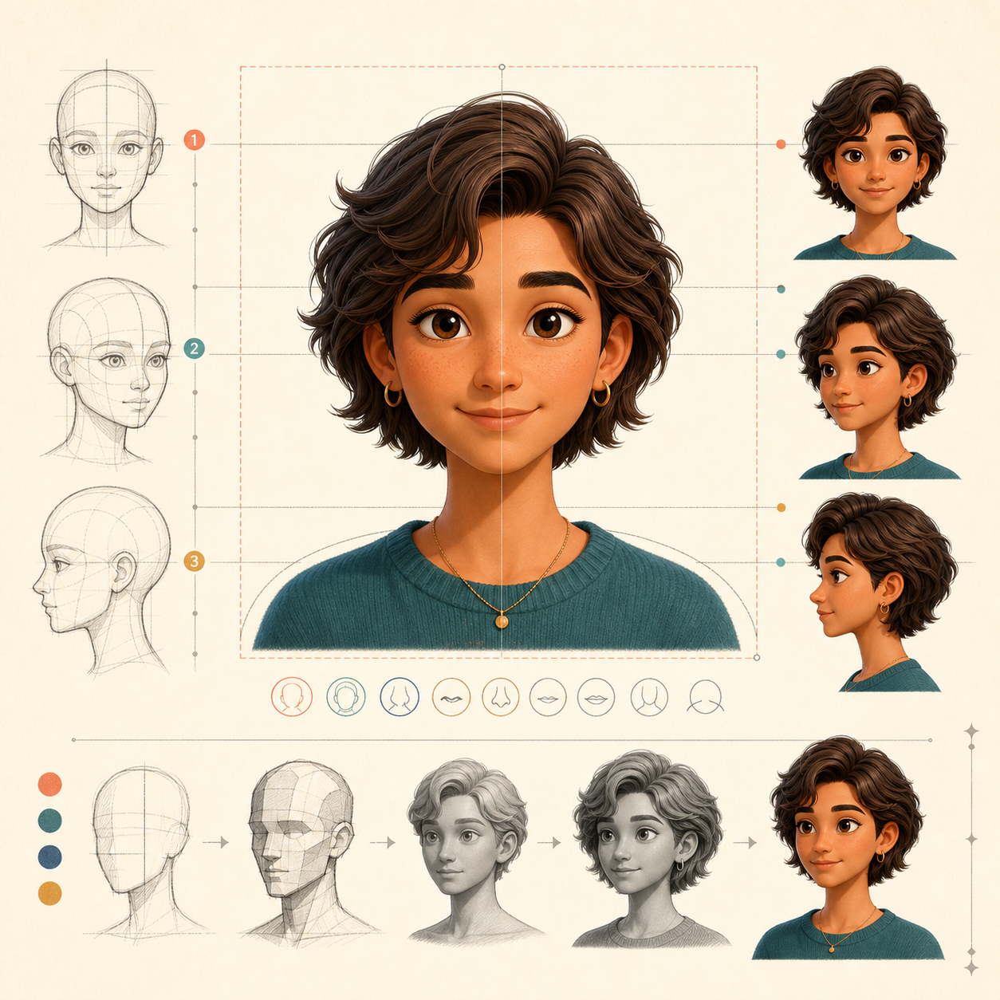

- Work at eye level in a square frame.
- Construct the skull before hair or headwear. Keep the cranium generous and the jaw softly designed rather than sharply realistic.
- Center the eyes near the vertical midpoint of the head, not the full canvas.
- Show the complete hair or head covering, full neck, both shoulders, and upper chest.
- Let the shoulder arc anchor the composition. Avoid a floating head, narrow neck, or clipped shoulders.
- Use a straight-on or restrained three-quarter pose. Palari portraits feel present and approachable, not dramatic.

## 2. Eyes and brows

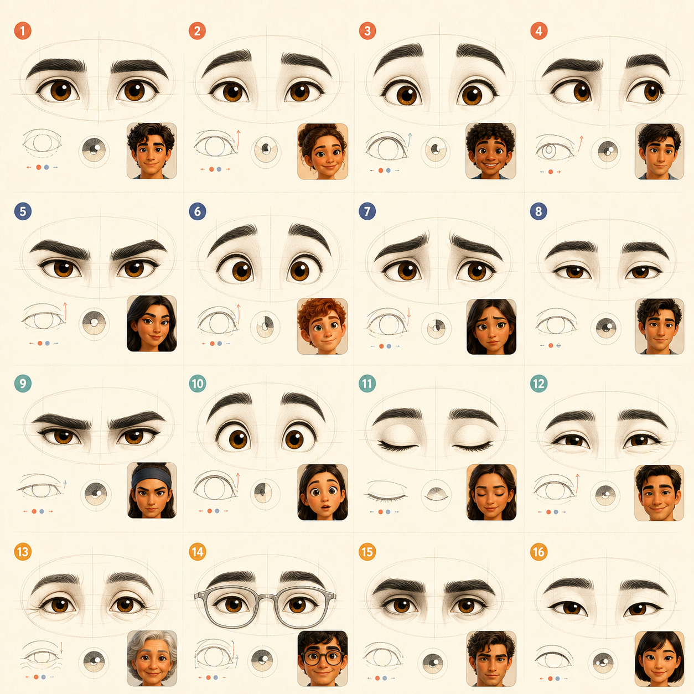

- Eyes carry most of the emotional read. They are warm and slightly enlarged, but remain attached to believable lids and sockets.
- Weight the upper lid more than the lower lid. Keep the lower edge soft.
- Use one controlled catchlight system across both eyes.
- Let brows describe rhythm and attitude; do not treat them as stickers above the face.
- Build expression through lids, brows, cheek lift, and gaze together.
- Avoid anime proportions, glassy doll eyes, tiny irises, or perfectly mirrored expression.

## 3. Noses and mouths

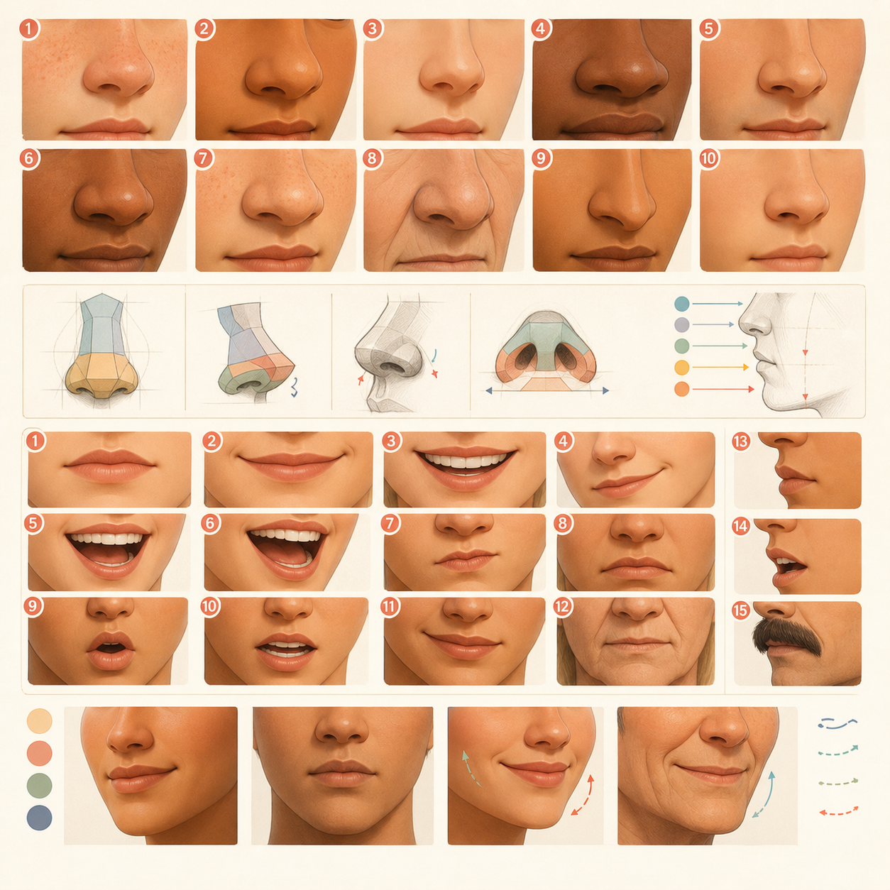

- Model the nose with a bridge plane, soft tip, nostril shape, and restrained underside shadow.
- Preserve genuine variety in bridge width, tip shape, projection, and nostril rhythm.
- At rest, mouths retain soft volume and slightly lifted, approachable corners.
- A smile changes cheeks and lower eyelids as well as the lips.
- Show teeth as a quiet grouped shape, never a row of individually outlined tiles.
- Facial hair follows the planes beneath it and should not erase the mouth.

## 4. Hair language

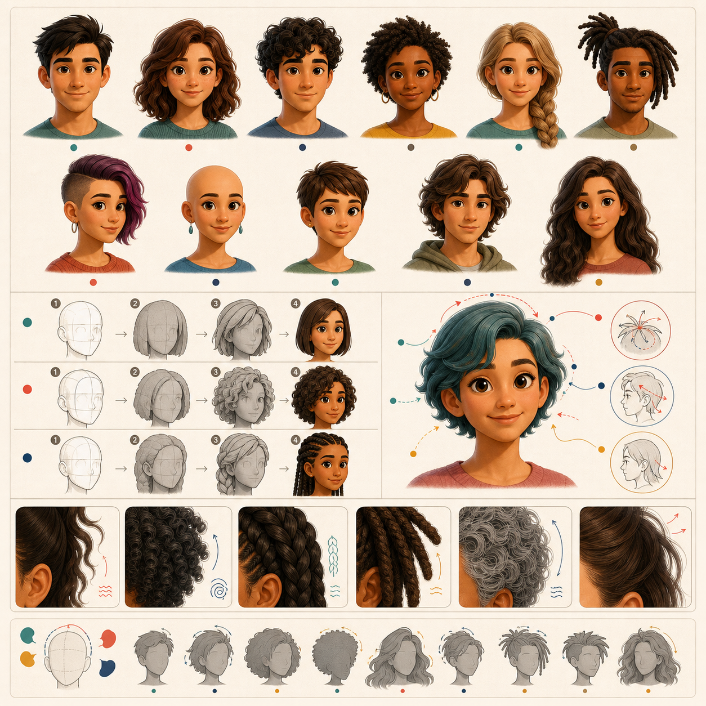

- Design hair from large to small: silhouette, primary masses, secondary clumps, then a few selective strands.
- Preserve the skull underneath. Volume should grow from a believable crown and hairline.
- Straight hair uses clean ribbons; waves use broad S-curves; curls use grouped coils; coily hair uses clustered volume; braids and locs use repeated forms with variation.
- Flyaways are accents at the silhouette, not noise across the whole hairstyle.
- Long hair must overlap shoulders deliberately while keeping the garment readable.
- Avoid plastic helmet hair, strand-by-strand engraving, random fuzz, or texture that destroys the large design.

## 5. Headwear, facial hair, and accessories

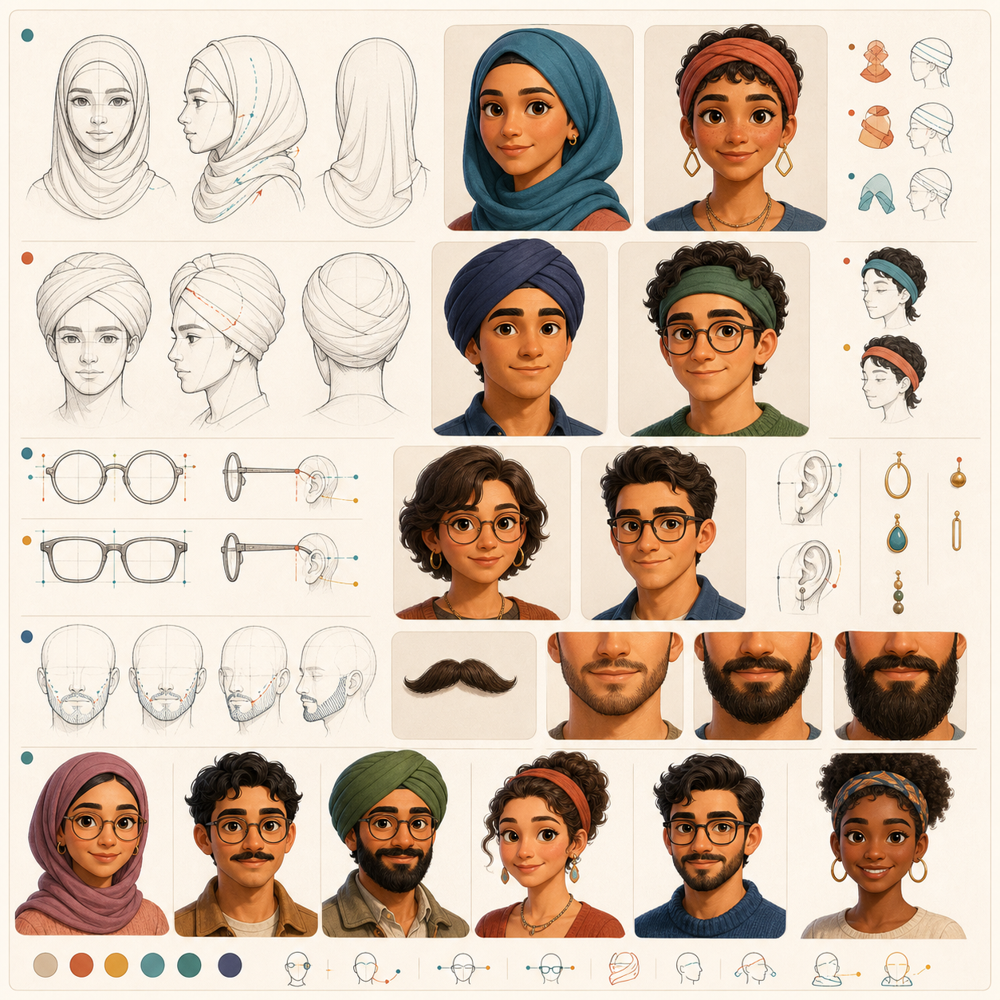

- Headwear follows the skull and has understandable fabric tension, folds, and weight.
- Treat hijabs, turbans, and headbands as designed forms with respectful specificity, not generic symbols.
- Glasses sit on the bridge and track the head perspective; lenses remain clear enough to preserve the eyes.
- Earrings and jewelry support the portrait hierarchy rather than competing with the face.
- Beards and mustaches inherit the underlying jaw and mouth construction.

## 6. Face shape, age, and variety

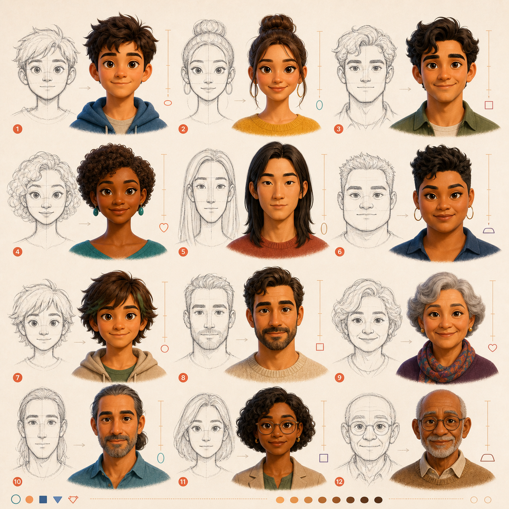

- Variety begins with cranial width, jaw rhythm, cheek volume, feature spacing, and silhouette, not surface color alone.
- Express age with proportion, eyelid weight, soft plane changes, smile lines, posture, and hair character.
- Keep older faces warm and dimensional without flattening them into wrinkle symbols.
- Avoid one default face with swapped hair, skin, or accessories.
- These are visual design observations, not claims about identity, ethnicity, gender, or exact age.

## 7. Garments and shoulders

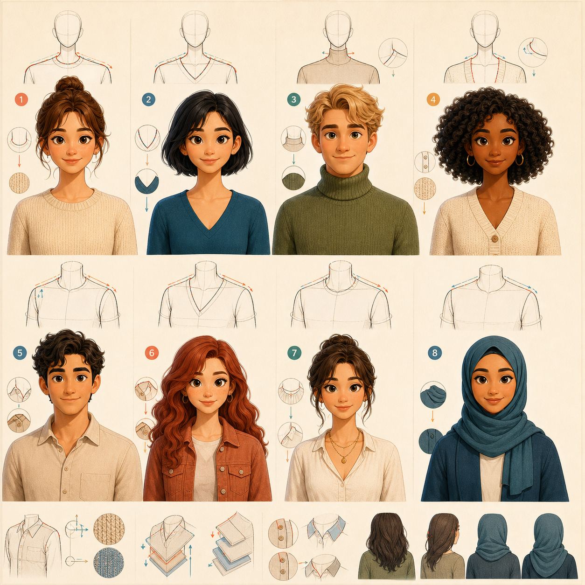

- The garment forms the lower compositional base. Its neckline must clearly separate from neck, hair, beard, and headwear.
- Keep both shoulders complete and use a believable shoulder slope.
- Describe fabric with a few structural folds and material-specific texture.
- Knit texture follows form; collars have thickness; layered garments overlap cleanly.
- Preserve enough upper chest for the portrait to feel grounded and for recoloring masks to remain reliable.

## 8. Light, color, and materials

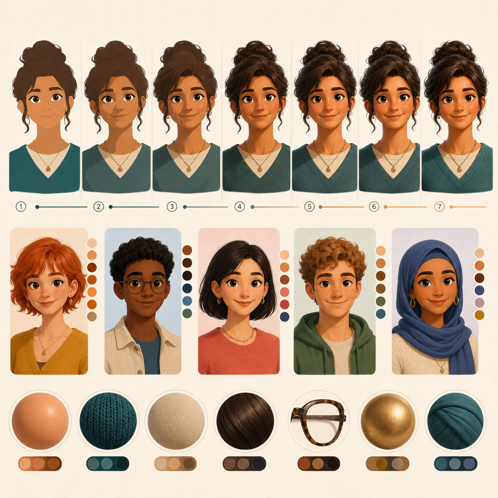

- Start with clean local colors and large value groups.
- Use a soft warm key, gentle fill, and controlled highlights. The face should feel dimensional without cinematic drama.
- Maintain separation between skin, hair, garment, accessories, and the pastel background.
- Texture should explain material: soft skin, coherent hair sheen, restrained knit or woven grain, clear glass, and small metal accents.
- Avoid film grain, pixelation, speckling, dirty gradients, sharpening halos, noisy pores, or hard rim light.

## 9. Expression, composition, and final polish

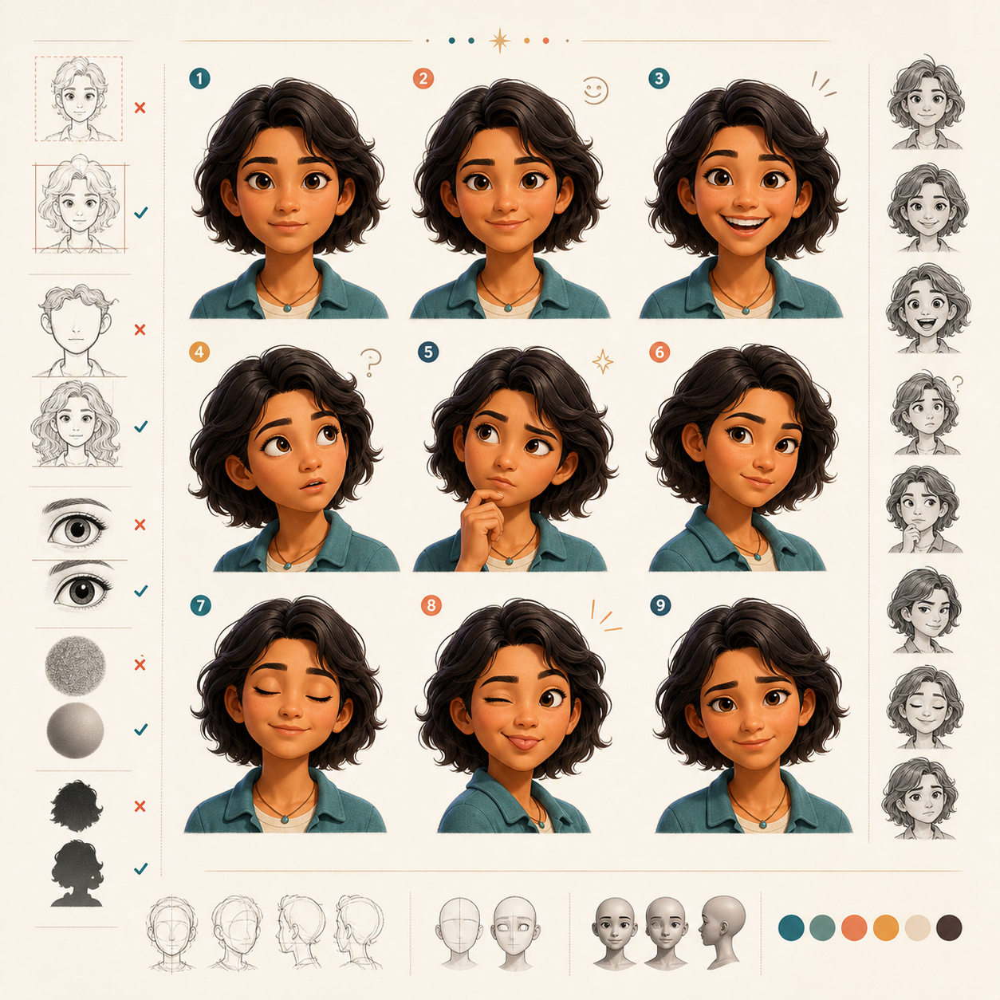

- Favor friendly natural expressions over extreme cartoon acting.
- Make asymmetry subtle but present: brow height, smile corner, hair flow, and shoulder position.
- Check the portrait first as a small silhouette, then at full resolution.
- The final image should remain readable when the background or garment changes color.
- Finish with clean edges and selective detail. Large shapes must remain stronger than microtexture.

## 10. Profile and rotation

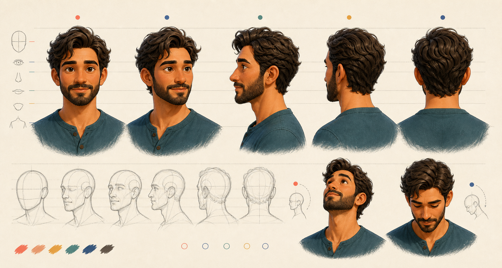

- Preserve one character's skull, feature spacing, hairline, jaw, ears, and neck through front, three-quarter, profile, and back views.
- Track the brow, eye, nose base, mouth, and chin on shared horizontal guides rather than redrawing each angle independently.
- In profile, keep the eye seated in the socket and make the nose, lips, and chin read as one designed silhouette.
- Use upward and downward views sparingly, with the features wrapping around the head instead of sliding vertically.

## 11. Facial planes and sculpt construction

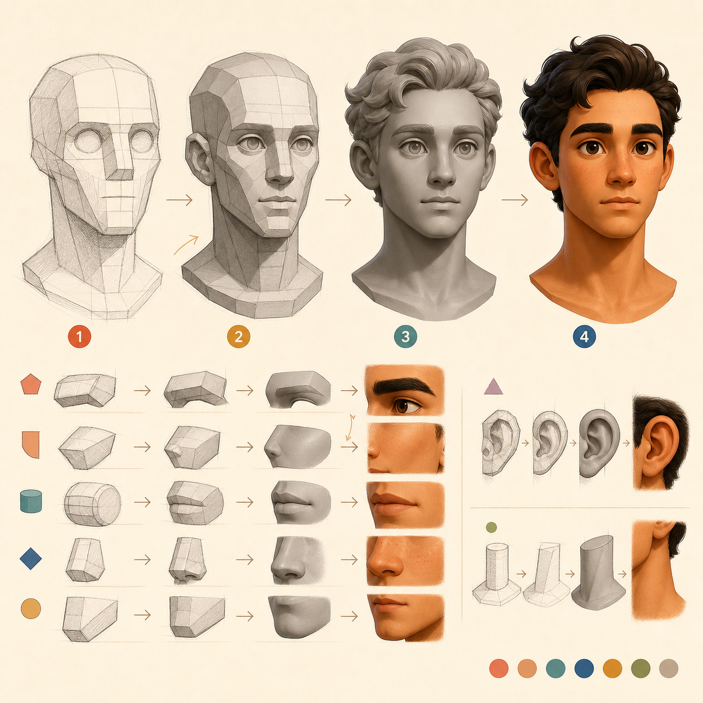

- Build from a simple cranium, muzzle, jaw, neck cylinder, and ear placement before softening the planes.
- Let brow, cheek, nose, mouth barrel, and chin interlock. The style is simplified, not flat.
- Retain broad, animation-friendly planes through the finished render; do not chase realistic pore-level anatomy.
- Evaluate the face in neutral clay before color and hair conceal construction problems.

## 12. Expression transitions

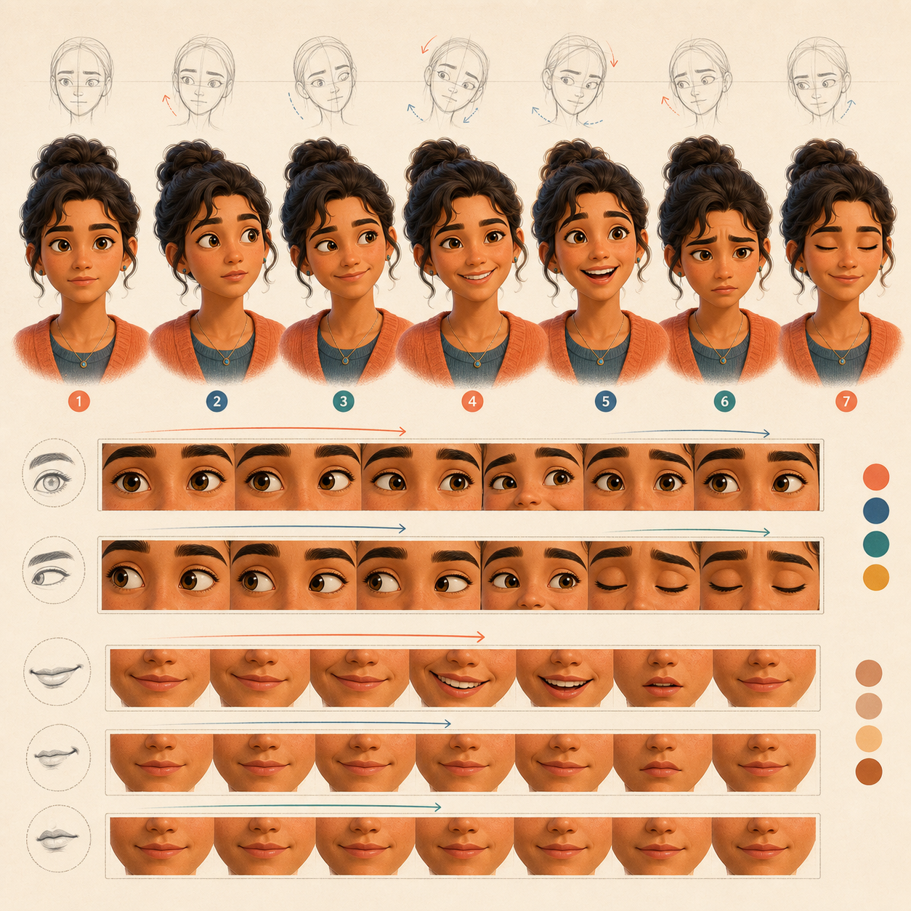

- Treat expressions as coordinated changes across brows, lids, gaze, cheeks, nostrils, mouth corners, and jaw.
- Move from neutral to the final expression through believable intermediate poses.
- Preserve identity and face volume while posing; a smile should not create a different character.
- Prefer readable, warm acting in the middle of the range over extreme squash or theatrical distortion.

## 13. Hair detail and edge architecture

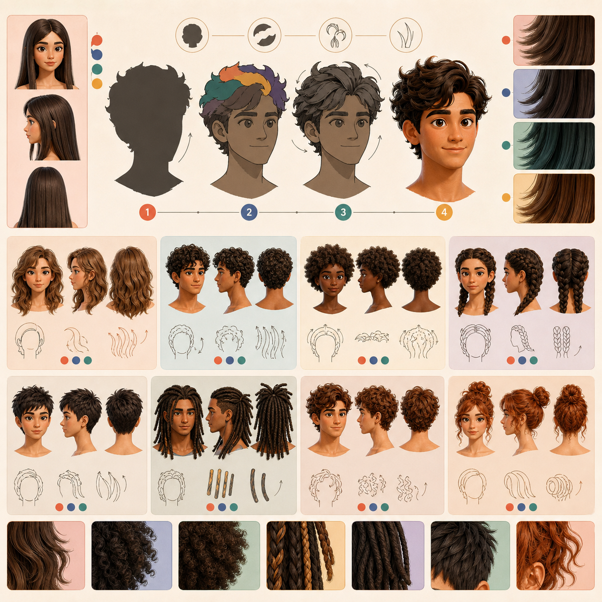

- Separate the hairstyle into silhouette, primary masses, overlapping clumps, and a small number of edge strands.
- Vary the edge language by hair structure: ribbons, waves, curls, coils, braids, locs, or controlled flyaways.
- Keep interior detail subordinate to the outer silhouette and major flow.
- Design bright edge accents as hair material and lighting, never as accidental background-colored halos.

## 14. Palette and background harmony

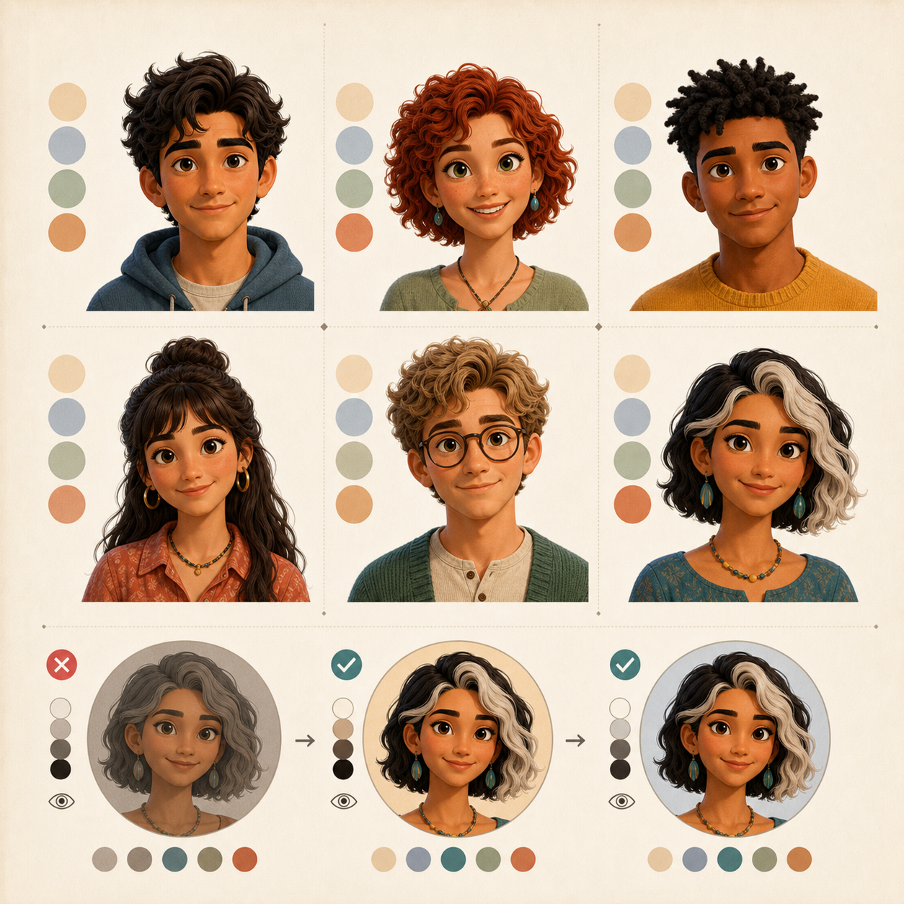

- Choose skin, hair, garment, accessory, and background colors as a five-part value system.
- Preserve clear boundaries even when garment and hair hues are related.
- Keep backgrounds soft enough to support the face while maintaining enough contrast for fine hair edges.
- Test every portrait in light, mid-value, warm, and cool background families before approval.

## 15. Headwear folds and fabric mechanics

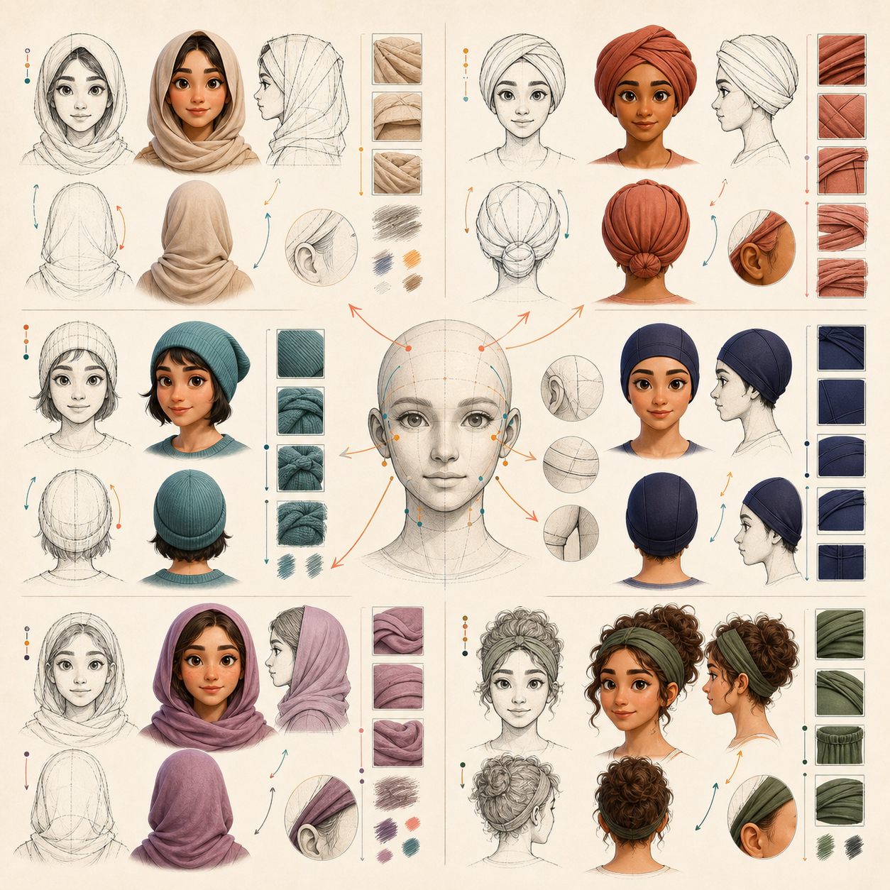

- Start from the skull and define anchor points, tension directions, compression, overlap, thickness, and gravity.
- Distinguish wrapped, draped, knitted, woven, and elastic materials through structure before texture.
- Check front, side, and back continuity so folds do not become decorative lines with no physical cause.
- Maintain respectful specificity and use references appropriate to the garment being designed.

## 16. 3D orthographic turnaround

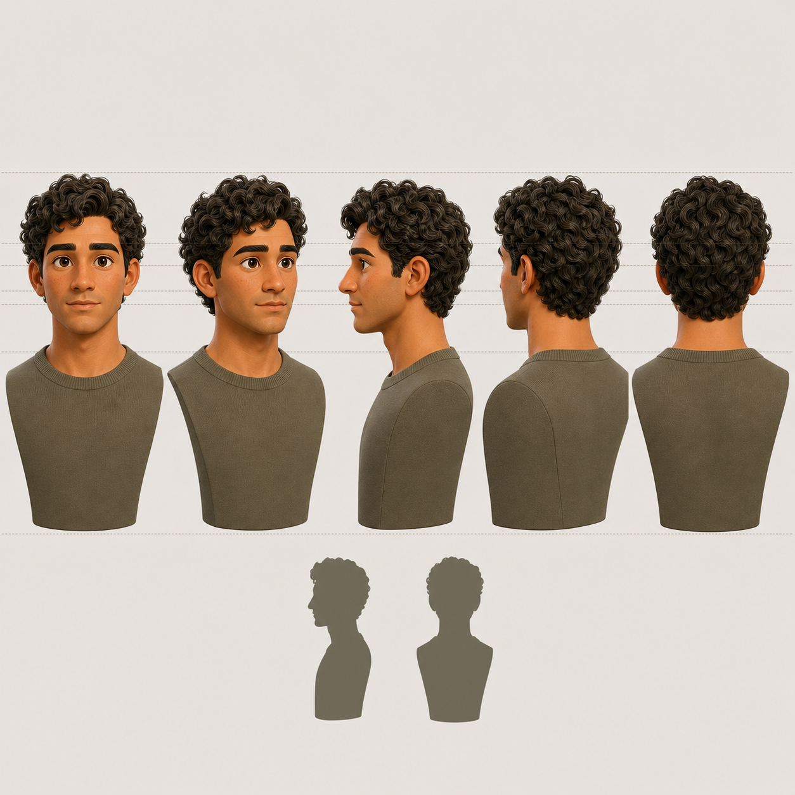

- Approve a neutral front, three-quarter, profile, and back turnaround before starting a production model.
- Keep camera height, scale, head tilt, shoulder width, and feature landmarks consistent across views.
- Show hair volume, ear placement, neckline, and back-of-head construction clearly enough to remove guesswork for the modeler.
- Treat this plate as visual development reference, not as a rotatable 3D asset by itself.

## 17. 3D sculpt, materials, and rig language

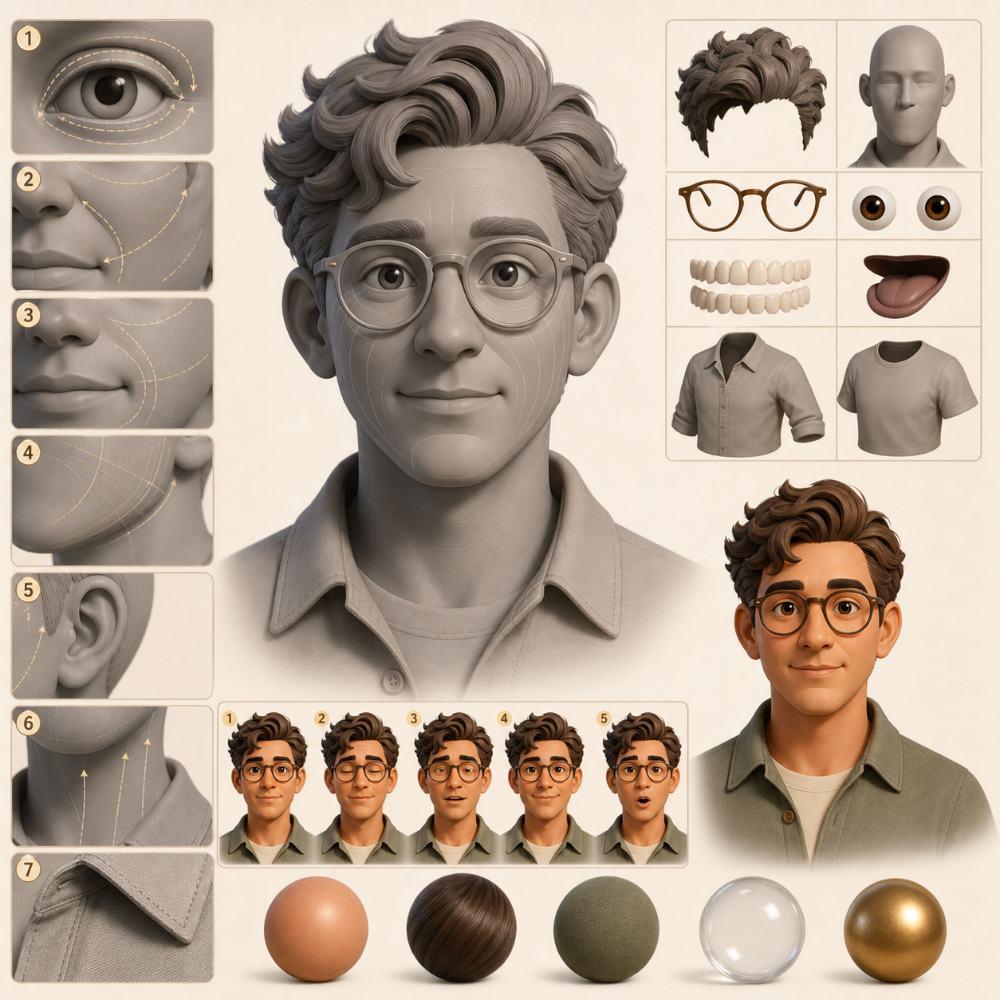

- Establish the character first as a clean neutral clay sculpt, then add production-friendly surface flow and separate hair, eyes, garment, and accessories.
- Use restrained stylized materials: soft skin response, grouped hair sheen, readable fabric roughness, clear lenses, and small metal highlights.
- Prepare deformation around eyelids, cheeks, lips, jaw, brows, and neck for natural expressions.
- Build a compact expression set around neutral, smile, blink, brow raise, and speech shapes while preserving the approved identity.

## Artist workflow

1. Block the square crop, skull, neck, and shoulder arc.
2. Establish a distinct face shape and feature spacing.
3. Choose one clear expression and solve eyes, brows, cheeks, and mouth together.
4. Add hair or headwear as large designed masses.
5. Construct accessories and garment overlaps.
6. Paint flat local colors with strong subject/background separation.
7. Add soft dimensional light and material-specific detail.
8. Simplify noise, verify complete hair and shoulders, and inspect boundaries at full resolution.
9. Test the portrait against several background and garment colors before approval.

## From these sheets to a real 3D Palari

Yes, a true 3D version is feasible. The guide plates establish the design target, but a usable model requires a separate production process:

1. Approve one character and its orthographic turnaround.
2. Sculpt or model the head, neck, shoulders, eyes, hair, garment, and accessories in Blender or equivalent software.
3. Retopologize for clean facial and shoulder deformation.
4. Create UVs, textures, and Palari-specific skin, hair, fabric, glass, and metal materials.
5. Rig the head and shoulders; add facial controls or blend shapes for lids, brows, cheeks, lips, and jaw.
6. Match the soft Palari camera, lighting, background, and render treatment.
7. Test animation and export the required format, such as glTF/GLB for the web, FBX for a broader 3D pipeline, or USDZ for Apple AR.

For a first production test, use one representative character with visible hair, glasses, and a simple garment. That single model will expose the important decisions about topology, hair construction, shaders, rig scope, and rendering before scaling to the full library.

## Generation provenance

The first nine guide plates were generated on 2026-08-05 and plates 10–17 were generated on 2026-08-06 with OpenAI built-in image generation in generation mode. Four repository portraits were supplied only as internal style and finish references: avatar-04.png, avatar-4x4-10-v1.png, avatar-coverage-002.png, and avatar-coverage-012.png. The prompts explicitly prohibit copying their identities, garments, hairstyles, or accessories. The prose guidance is a human-authored synthesis of the reviewed 157-portrait Palari library. The 3D plates are design references rather than meshes, rigs, or production-ready 3D files.
