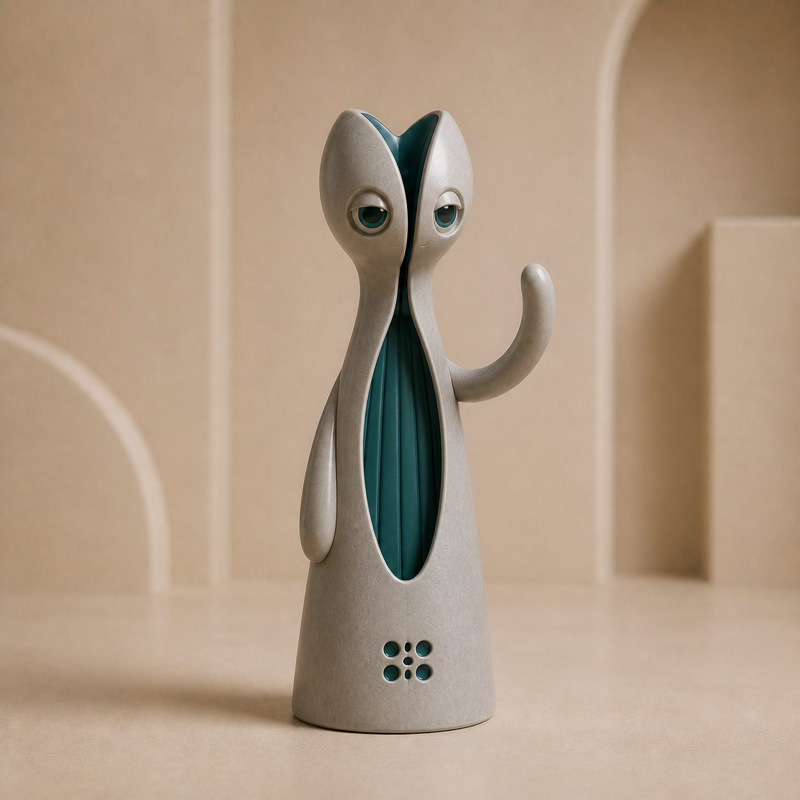
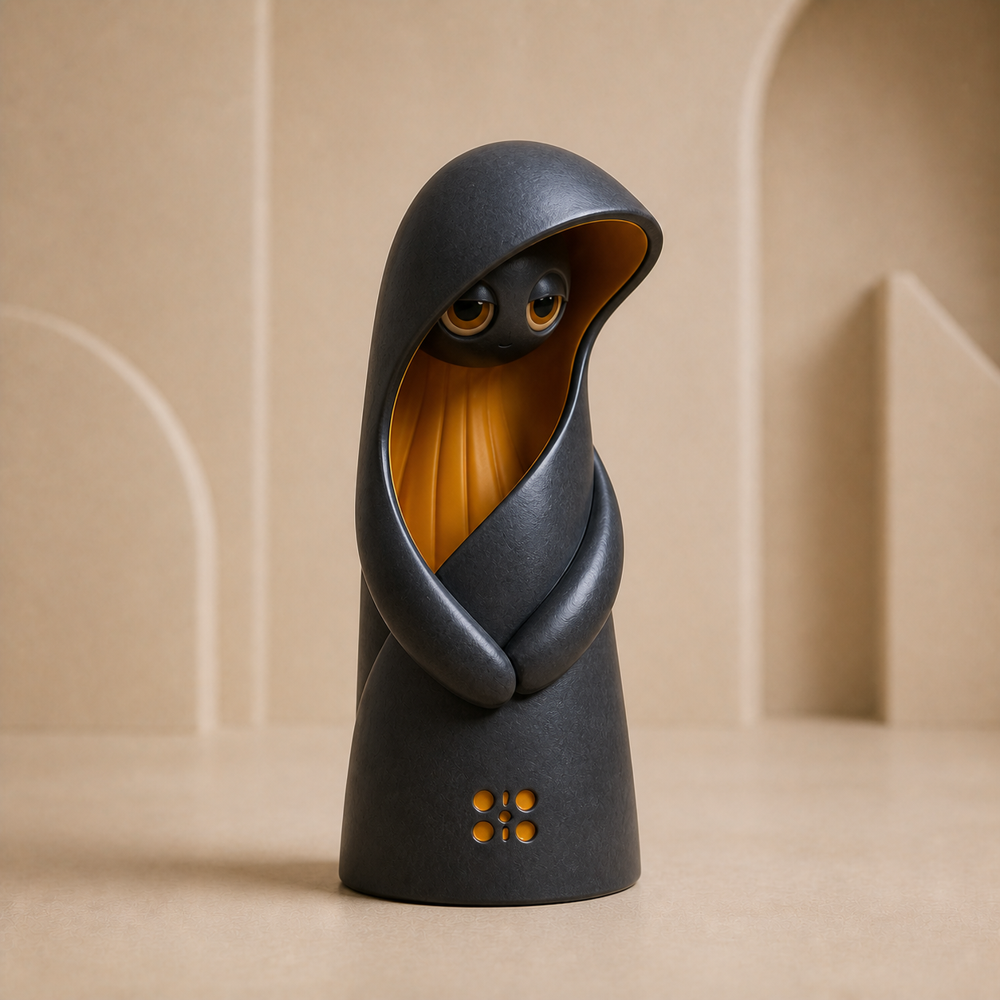
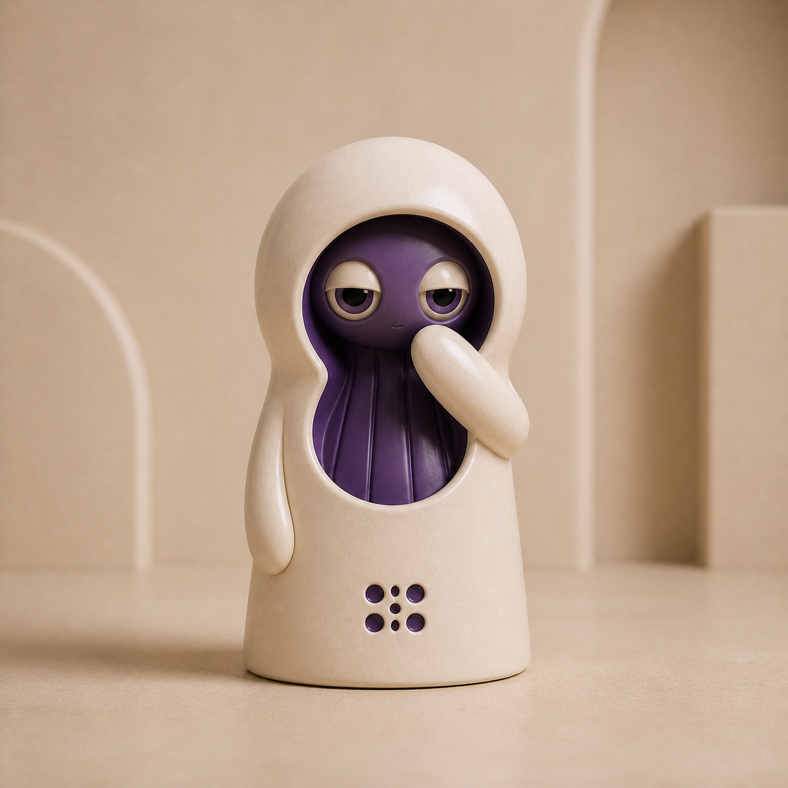
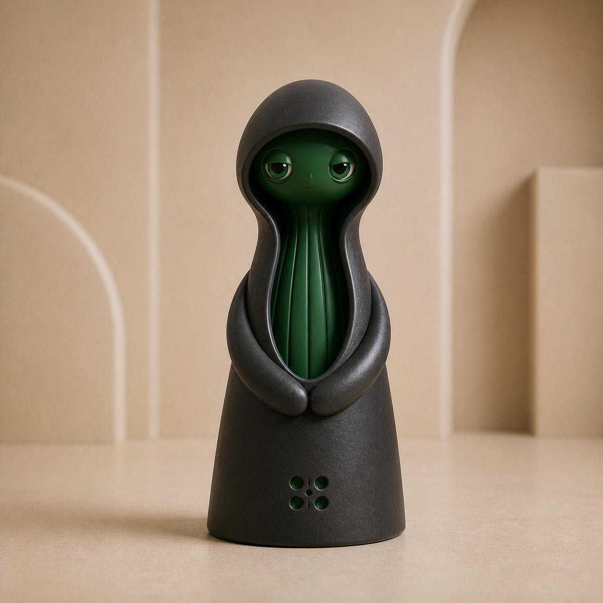
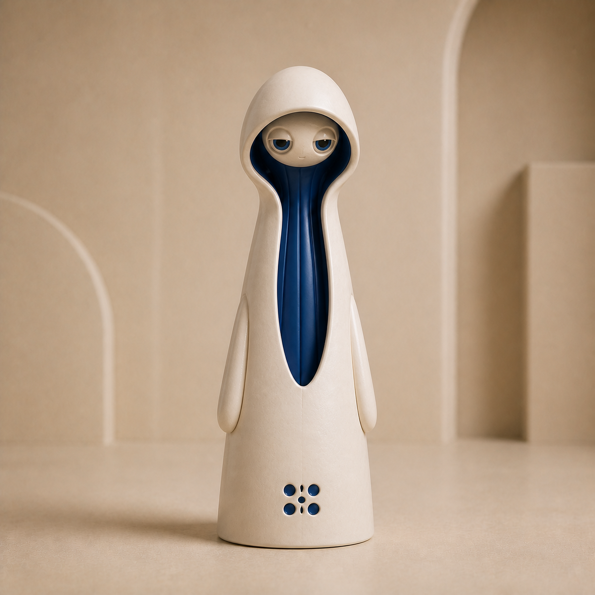

# Palari V2 controlled-random audit 01

- Date: 2026-08-08
- Grammar entering audit: 0.1.0
- Grammar after audit: 0.2.0
- Review state: exploratory; no candidate is production-approved

## Purpose

This batch tests whether the provisional grammar can create new Palari figures while preserving family invariants. Each image contains one figure and uses the five individual finalists as visual references. The batch covers all six silhouette families, all four material colors, and eight characteristic colors.

The built-in image-generation path did not expose an exact model identifier. The reference paths, selected variables, output checksums, and review outcomes are retained in `manifest.json`. Future batches must also retain the complete expanded prompt verbatim.

## Results

| ID | Result | Review |
| --- | --- | --- |
| A01 | Pass | Column, stone, and teal remain coherent; greeting arm is fingerless; seed mark is stable. |
| A02 | Pass | Charcoal retains form and amber readability; protective arch is distinct and resolved. |
| A03 | Reject | Crescent creates an upward-facing vessel cavity and violates the non-vessel rule. |
| A04 | Reject | Pod drifts toward chibi proportions and lets the circular opening surround the face. |
| A05 | Pass | Charcoal bell remains readable; hood, embrace, and forest interior belong to the family. |
| A06 | Reject | Attractive Palari, but it does not visibly produce the requested two-mass stack geometry. |
| A07 | Pass with note | Strong family result, but too structurally similar to existing hooded columns. |
| A08 | Pass | Integrated arch and mineral-red overlap are coherent, although later batches should push more structural novelty. |

Five of eight candidates pass the first review. A06 demonstrates why variable fidelity must be scored separately from general aesthetic quality.

## Candidate images

| A01 | A02 |
| --- | --- |
|  |  |

| A03 | A04 |
| --- | --- |
|  |  |

| A05 | A06 |
| --- | --- |
|  |  |

| A07 | A08 |
| --- | --- |
|  |  |

## Grammar changes

1. Replace open `asymmetric_sweep` with `closed_asymmetric_sweep` and forbid upward-facing crescent cavities.
2. Replace `circular_aperture` with `low_circular_aperture`, requiring a ceramic bridge below the face.
3. Add a 2.4:1 minimum overall-height-to-visible-face-height guard.
4. Strengthen Stack to require two visibly offset exterior masses, distinct centers, and a clear overlap seam.
5. Require at least two structural fields to differ from retained references.
6. Add selected-variable fidelity and structural novelty to the rejection scorecard.
7. Retain the six-aperture Palari seed mark as the current V2 identity glyph.

## Next audit

Audit 02 should target only the corrected failure modes: two closed crescents, two adult-proportion pods, two visibly interlocking stacks, and two structurally novel controls. A second broad random batch would add less information than this focused test.
