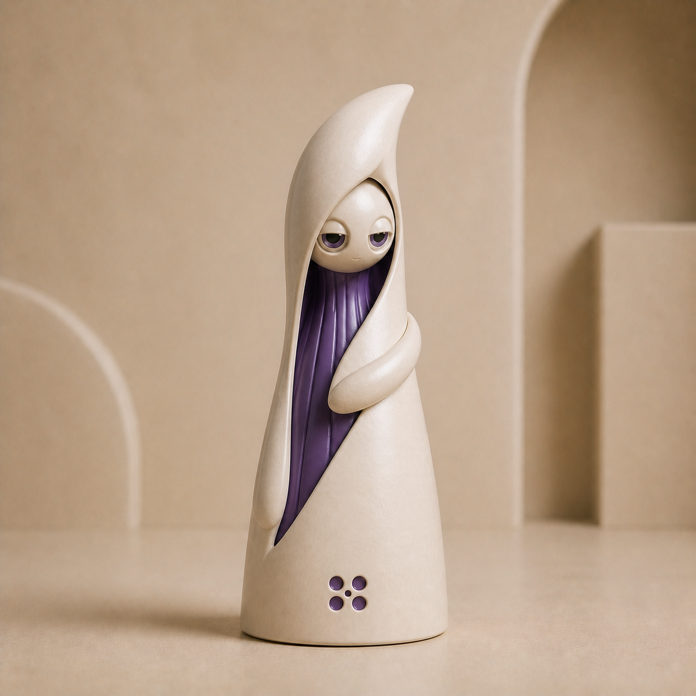
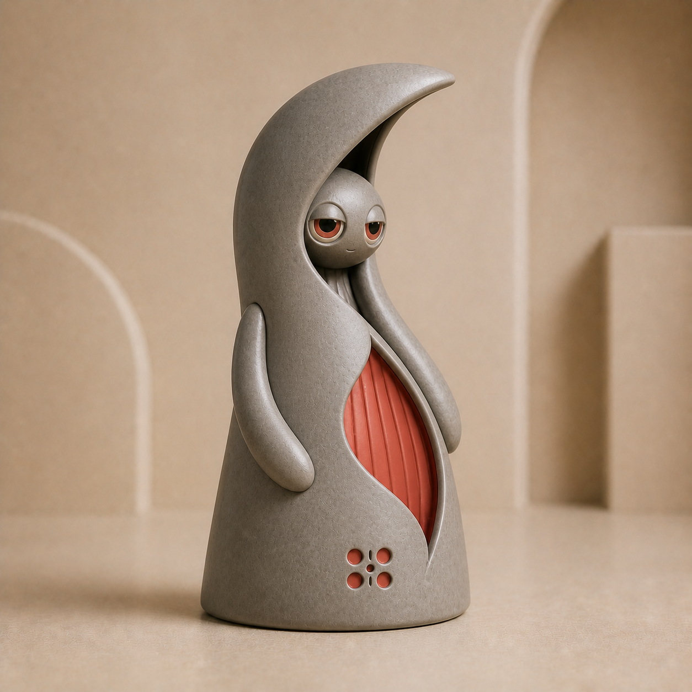
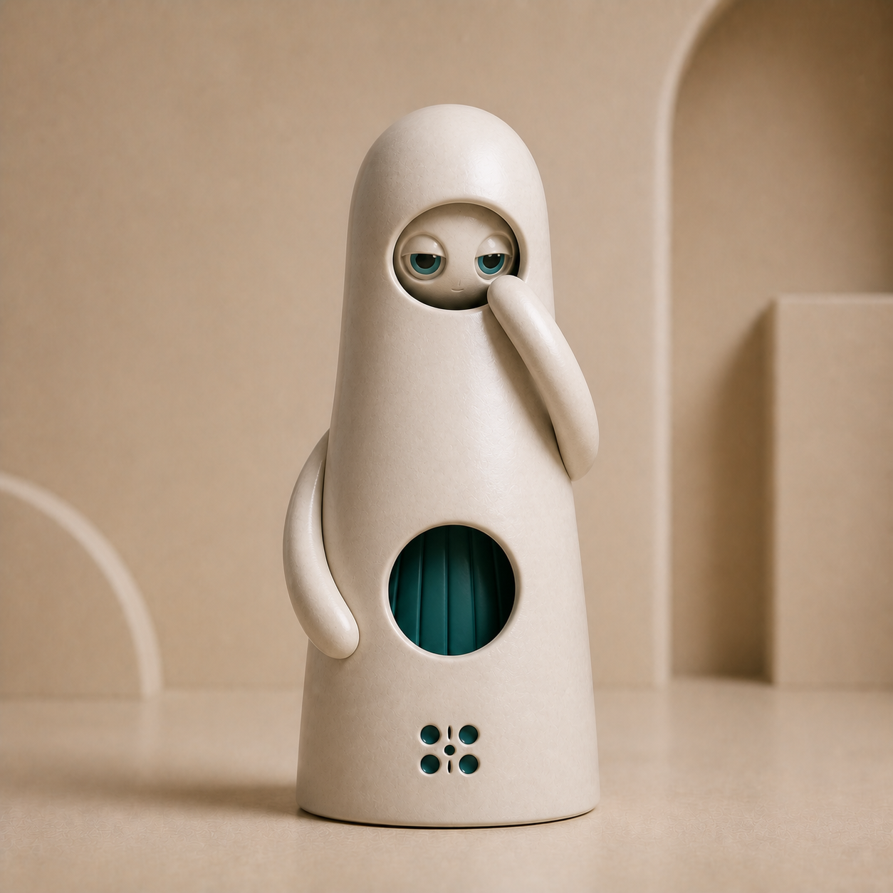
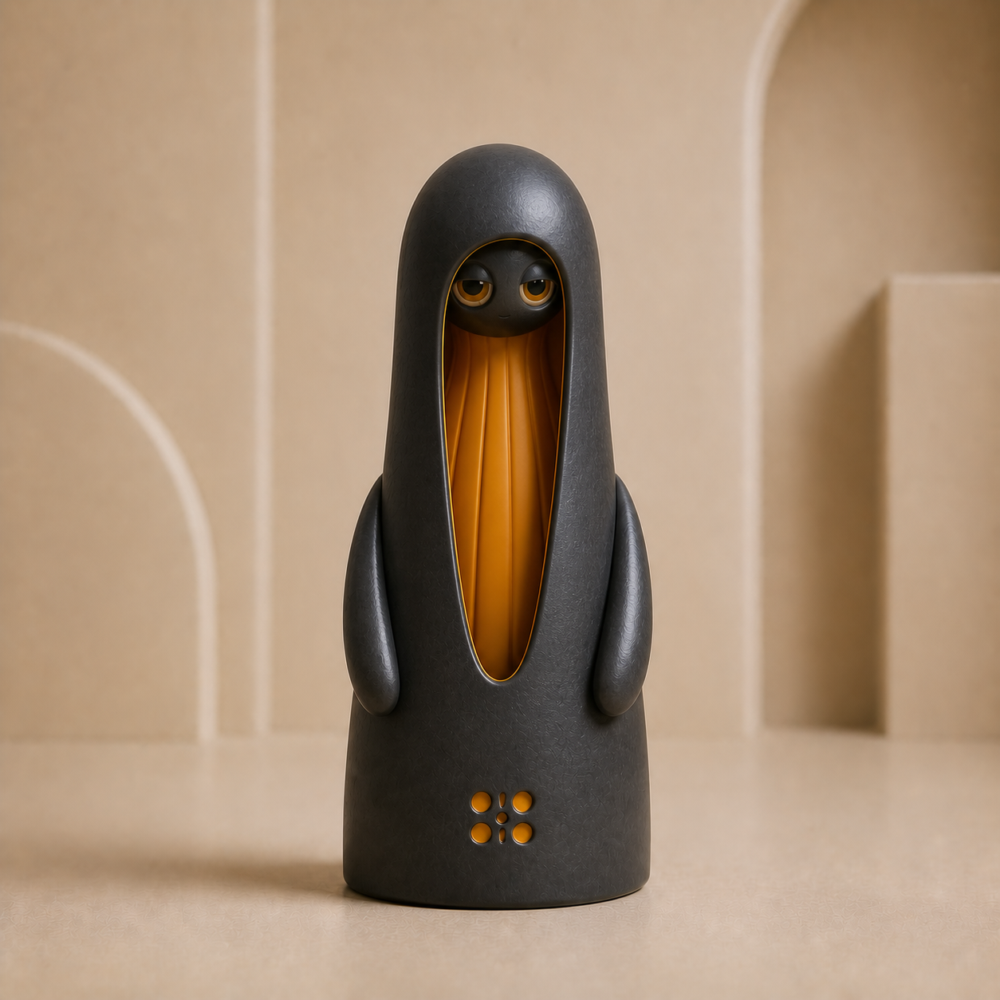
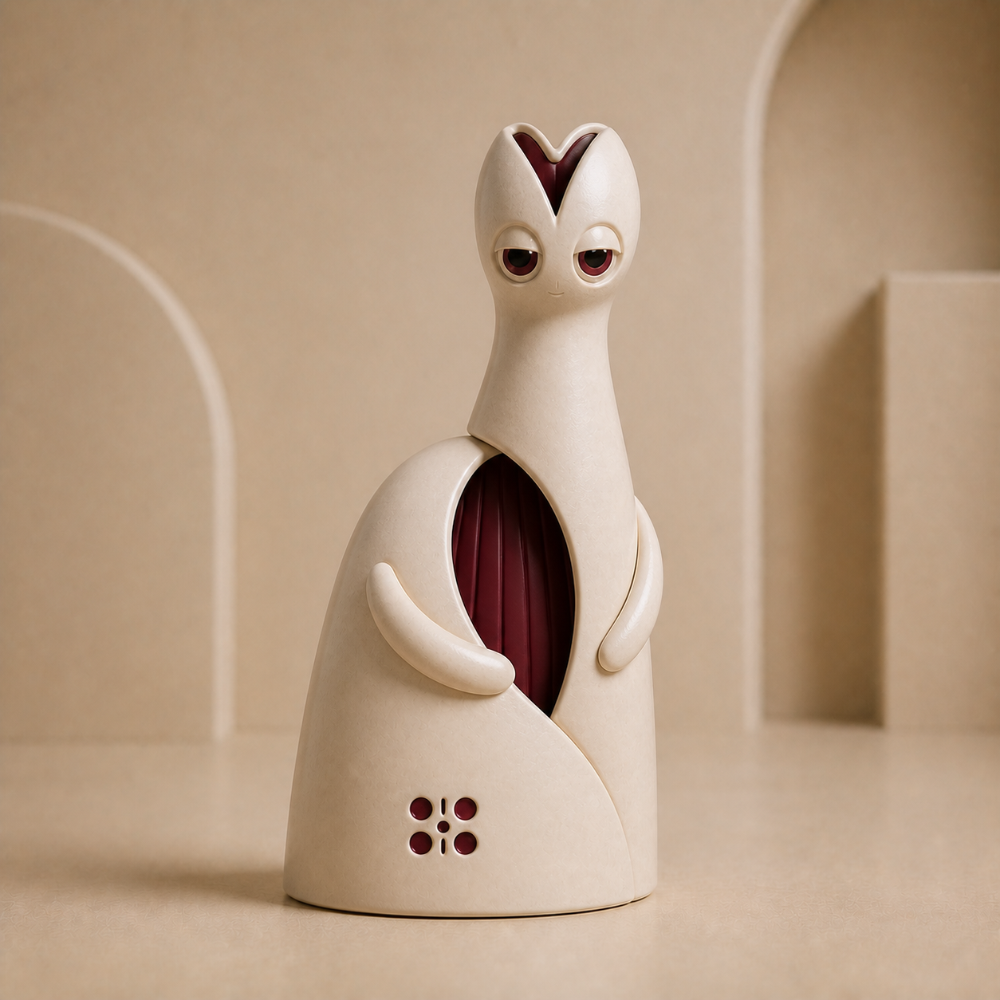
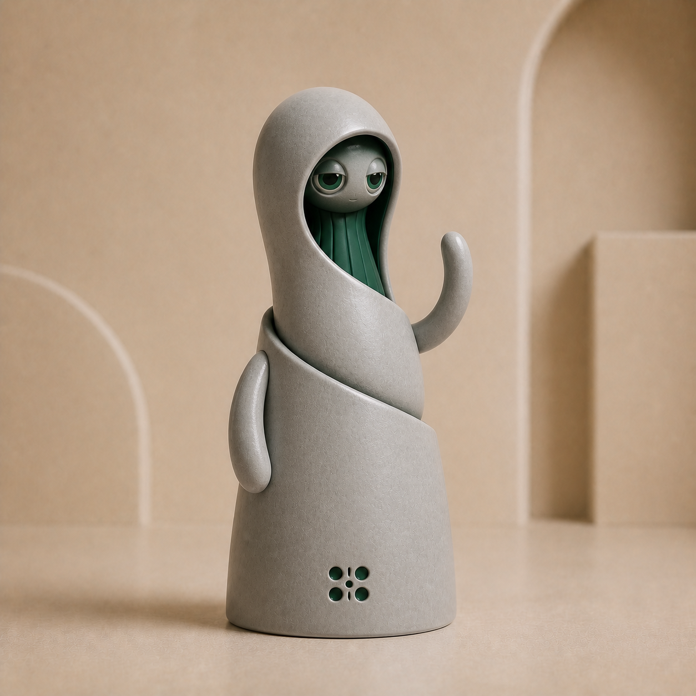
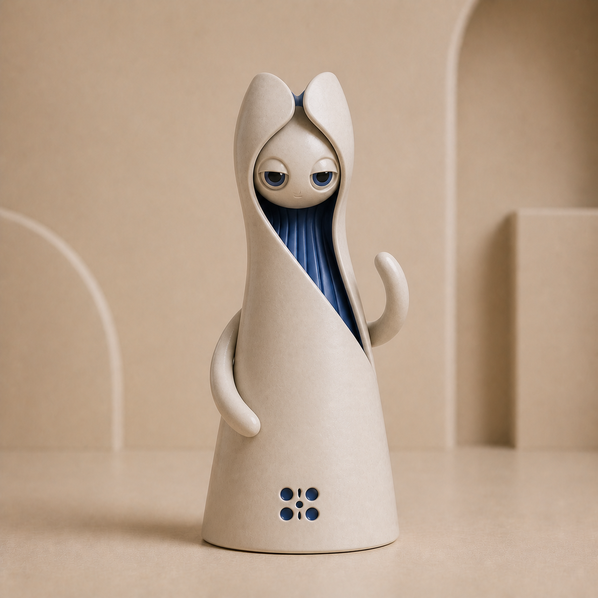
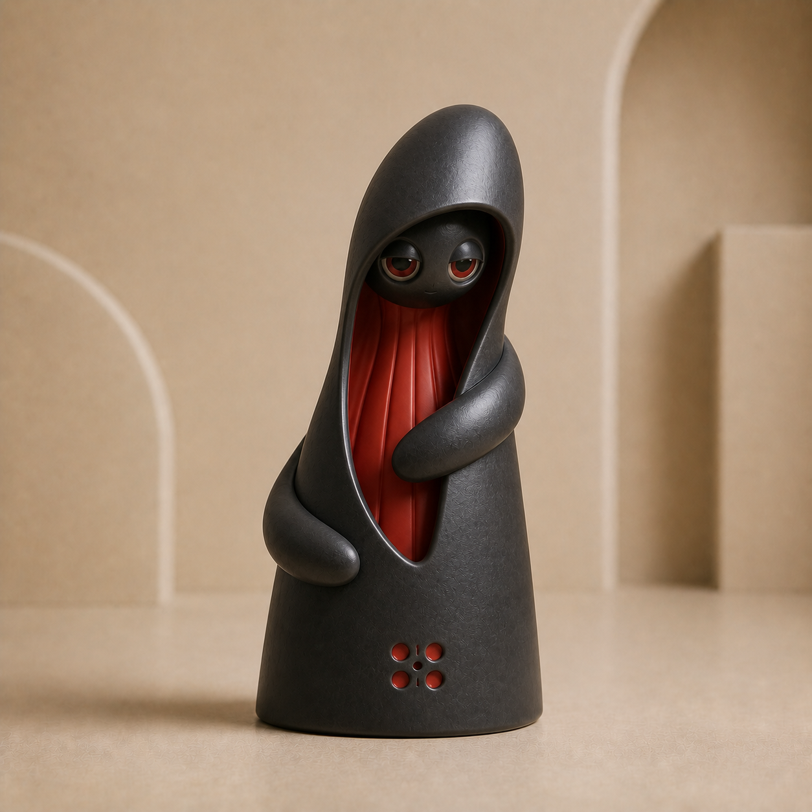

# Palari V2 focused audit 02

- Date: 2026-08-08
- Grammar entering audit: 0.2.0
- Grammar after audit: 1.0.0
- Review state: complete for visual grammar freeze; candidates remain concept sources until production isolation and masking

## Purpose

Audit 02 targets only the failures from Audit 01: open crescent cavities, chibi pod proportions, unconvincing Stack geometry, and insufficient structural novelty.

## Results

| ID | Result | Review |
| --- | --- | --- |
| B01 | Pass | Closed ivory crescent has no upward cavity and keeps a long violet reveal. |
| B02 | Pass | Closed stone crescent reads as sculptural architecture rather than a vessel. |
| B03 | Pass | Porcelain pod is mature in proportion and keeps its teal aperture fully below the face. |
| B04 | Pass with note | Charcoal pod is elongated and column-like, but satisfies the mature-proportion and opening rules. |
| B05 | Pass | Two offset ivory masses, distinct centers, and a visible seam establish the Stack family. |
| B06 | Pass | The stone Stack clearly uses two widths and a strong curved overlap seam. |
| B07 | Pass with note | Split shell and diagonal wrap provide novelty, though the requested twist remains subtle. |
| B08 | Reject | It belongs to the family but does not express the requested offset shell lobe strongly enough to count as a novelty control. |

Seven of eight pass. Combined with the five Audit 01 passes, this produces the initial 12-shape collection.

## Candidate images

| B01 | B02 |
| --- | --- |
|  |  |

| B03 | B04 |
| --- | --- |
|  |  |

| B05 | B06 |
| --- | --- |
|  |  |

| B07 | B08 |
| --- | --- |
|  |  |

## Freeze decision

Visual grammar 1.0 freezes:

- one ceramic exterior material and exactly one characteristic hue;
- calm inset half-lidded eyes;
- tubular fingerless arms and a continuous legless base;
- one dominant architectural reveal;
- the six-aperture Palari seed mark;
- compatible silhouette, crown, opening, and pose combinations;
- closed crescent tops, mature pod ratios, and visibly interlocking Stack volumes;
- a requirement that retained figures differ in at least two structural fields.

The next gate is technical rather than aesthetic: isolate the 12 accepted figures, create deterministic exterior and characteristic masks, and prove material/characteristic recoloring in the browser.
